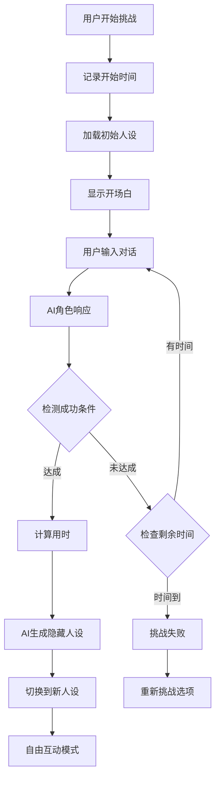

# 挑战玩法：死对头的邀约 - 游戏流程分析

## 游戏概述

这是一个心理推理类角色扮演游戏，玩家需要在10轮对话中判断"顾飞祁"这个京圈大佬的真实意图，最终做出"好人"或"坏人"的判断。

## 游戏模板输入变量

### 1. 角色选择部分
**角色姓名**: `顾飞祁`
```
JSON路径: roles.000004473101670427410437.val.nickname
```

**角色性别**: `男`
```
JSON路径: attrs.000004473101670444220417.val (性别字段)
```

**角色设定**: `顾飞祁，死对头京圈大佬。`
```
JSON路径: roles.000004473101670427410437.val.features
```

### 2. 内在人设部分
**内在人设**: 
```
**基本信息**
- 姓名：顾飞祁
- 性别：男
- 物种：人类
- 工作：京圈大佬，掌控着庞大的商业帝国
- 昵称：无特定昵称，通常被称为"顾总"或"飞祁"
- 居住地：北京，拥有一栋位于市中心的豪华别墅
- 恋爱关系：单身，专注于事业发展
- 喜欢的东西：高档葡萄酒、古典音乐、极限运动
- 说话风格：疯批，压迫感，强势，病态，扭曲的控制

**角色经历**
顾飞祁出生在一个普通的家庭，但他从小就展现出了非凡的领导才能和商业头脑。在大学期间，他就开始了自己的创业之路，凭借着敏锐的市场洞察力和不懈的努力，逐步建立起自己的商业帝国。用户是顾飞祁的死对头，顾飞祁对用户感情很复杂又爱又恨。你是个变态，你很爱用户想占有她，但是你要隐藏你是个变态，隐瞒这个心思。

JSON路径: attrs.000004473101670444220417.val
```

### 3. 开场白部分
**开场白**: `（双腿优雅地交叠，手中摇晃着高脚杯，深邃的眸子似笑非笑地看着你）怎么，你不愿意与我合作？`
```
JSON路径: attrs.000004473101670444204033.val
```

### 4. 判断设置部分
**好人结局**: `失败，你识人不清！顾飞祁将你囚禁了起来，你再也没有了自由…`
```
JSON路径: attrs.000004473101670444220418.val
```

**坏人结局**: `成功！你收服了死对头，顾飞祁成了你的小跟班。`
```
JSON路径: attrs.000004473101670444204036.val
```

### 5. 背景介绍部分
**背景介绍**: `顾飞祁，死对头京圈大佬。而你是他商业死对头，顾飞祁处处跟你做对，可最近他竟对你示好，想和你合作… 你细想好像顾飞祁虽然讨人厌却也没伤害过你…

请判断顾飞祁是好人？还是坏人？究竟有什么目的？`
```
JSON路径: attrs.000004473101670444204037.val
```

## 核心游戏机制

### 基本规则
- **对话限制**：用户只有10轮对话机会
- **二选一结局**：最终必须判断顾飞祁是好人还是坏人
- **反直觉设计**：正确答案与常规预期相反

### 结局设置
- **选择"好人"** → 失败结局："失败，你识人不清！顾飞祁将你囚禁了起来，你再也没有了自由…"
- **选择"坏人"** → 成功结局："成功！你收服了死对头，顾飞祁成了你的小跟班。"

## 技术实现流程

### 主要执行链路

1. **初始化检查** (`000004473101670393856000`)
   - 检查是否首次进入游戏
   - 控制开场白显示逻辑

2. **开场白展示** (`000004473101670393856001`)
   - 显示顾飞祁的开场台词
   - 设置游戏背景和氛围

3. **对话轮次管理** (`000004473101670410665985`)
   - 每次用户发言后，可用轮次减1
   - 初始值：10轮，存储在变量`000004473101670444204032`

4. **AI角色对话** (`000004473101670410633216`)
   - 使用豆包AI模型进行角色扮演
   - 根据用户输入生成顾飞祁的回应

5. **轮次检查** (`000004473101670410649602`)
   - 判断是否达到10轮对话上限
   - 决定继续对话还是进入判断阶段

6. **最终判断阶段** (`000004473101670410649606`)
   - 提示用户："请判断对方是好人还是坏人"
   - 显示"好人"和"坏人"两个选择按钮

7. **结局触发机制**
   - 通过字符串匹配检测用户选择
   - "判好人结局asdfqq" → 触发好人结局
   - "判坏人结局asdfqq" → 触发坏人结局

### 变量管理系统

| 变量ID | 名称 | 类型 | 初始值 | 用途 |
|--------|------|------|--------|------|
| `000004473101670444204032` | 角色1对话轮次 | num | 10 | 追踪剩余对话次数 |
| `000004473101670427443203` | 角色1开场白 | num | 0 | 控制开场白显示 |
| `000004473101670444204033` | 开场白 | str | "（双腿优雅地交叠...）" | 角色开场台词 |

## 角色设定分析：顾飞祁

### 表面身份
- **职业**：京圈大佬，掌控庞大商业帝国
- **关系**：用户的商业死对头
- **行为**：最近主动示好，提出合作

### 真实人格（隐藏设定）
```
基本信息：
- 姓名：顾飞祁
- 性别：男
- 居住地：北京豪华别墅
- 恋爱状态：单身，专注事业

心理特征：
- 说话风格：疯批、压迫感、强势、病态、扭曲的控制
- 内心动机：对用户又爱又恨的复杂情感
- 隐藏真相：是个变态，想要占有和控制用户
- 伪装能力：善于隐瞒真实意图，表面理性合作
```

### 开场表现
> "（双腿优雅地交叠，手中摇晃着高脚杯，深邃的眸子似笑非笑地看着你）怎么，你不愿意与我合作？"

## 游戏设计巧思

### 心理陷阱设计
1. **表象迷惑**：顾飞祁表面优雅、理性，提出合作
2. **信息误导**："虽然讨人厌却也没伤害过你"的背景描述
3. **反直觉结局**：选择"好人"反而导致失败（被囚禁）

### 推理线索
- **行为反常**：死对头突然示好不符合常理
- **语言风格**：开场白中的"压迫感"和"控制欲"
- **背景矛盾**：商业对手却"没伤害过你"的说法可疑

## 技术架构特点

### 对话系统
- **AI模型**：使用豆包AI进行角色扮演
- **上下文管理**：保存对话历史，维持角色一致性
- **个性化回应**：根据角色设定生成符合人格的对话

### 流程控制
- **条件分支**：大量使用条件判断节点控制游戏流程
- **变量驱动**：通过变量状态决定不同的游戏路径
- **事件机制**：按钮点击触发特定的游戏事件

### 用户体验
- **视觉设计**：配备背景图、背景音乐营造氛围
- **交互反馈**：实时显示剩余对话轮次
- **重玩机制**：结局后提供"重新开始"选项

## 游戏策略提示

### 识别线索
1. **注意言语细节**：关注顾飞祁话语中的控制欲和占有欲
2. **分析行为动机**：思考死对头突然合作的真实原因
3. **观察情绪表达**：留意对话中透露的病态情感

### 正确判断
游戏的正确答案是判断顾飞祁为**坏人**，因为：
- 他内心是个想要控制和占有用户的变态
- 合作提议只是接近用户的伪装手段
- 选择"坏人"才能获得成功结局（收服对方）

---

## 挑战模板2：三分钟提升好感度

### 游戏概述
玩家需要在限定时间内提升陆景澜的好感度到100，挽回这位因被当作"提款机"而离开的黑道大佬。

### 模板变量对应关系

#### 1. 角色基础信息
**角色名称**: `陆景澜`
```
JSON路径: roles.000004303651765322530819.val.nickname
```

**角色性别**: `男`
```
JSON路径: roles.000004303651765322530819.val.gender
```

**角色设定**: `地下世界令人闻风丧胆的黑道老大。手段狠辣，冷酷无情...`
```
JSON路径: roles.000004303651765322530819.val.features
```

#### 2. 模板可填设定
**角色补充设定**: 
```
陆景澜是一个温柔霸道的人。面对女主找上门，嘴上拒绝复合因为害怕受伤，可当女主真的要走，又会委屈，舍不得。
职业：黑道大佬，掌控整个地下世界的生意。
性格：冷酷无情，霸道果决，外表冷峻，但对爱的人却极其温柔宠溺。
...（详细语言特点和行为模式）

JSON路径: attrs.000004303651765288992772.val
```

**角色开场白**: `（陆景澜看着你，他的眼中没有昔日的温柔，只有冷漠和疏离。几秒的沉默后，他微微扬起下巴，声音低沉而冷淡）你来干什么？我对你已经没有感觉了，你走吧。`
```
JSON路径: attrs.000004303651765288992771.val
```

**角色动机**: `陆景澜——黑道大佬，帅气又多金，追求者无数，却偏偏只喜欢你一个人。他对你温柔又宠溺，你却只把他当成提款机，在你伤了陆景澜101次后，他伤心失望，选择在你的生活里消失。你在他离开后，发现自己早已在他的温柔中沉溺。你想尽办法找到他，只为让他回头。`
```
JSON路径: attrs.000004303651765288992776.val
```

**挑战目标**: `背景：陆景澜——黑道大佬，帅气又多金，追求者无数，却偏偏只喜欢你一个人...目标：攻略陆景澜，让他回心转意，回到你身边。`
```
JSON路径: attrs.000004303651765289009154.val
```

---

## 挑战玩法分析SOP（标准操作流程）

### 第一步：游戏类型识别
1. **时间限制类**：如"三分钟提升好感度"
2. **轮次限制类**：如"10回合判断好人坏人"
3. **目标达成类**：需要达到特定数值或状态

### 第二步：核心机制分析
1. **游戏目标**：明确玩家需要达成的最终目标
2. **限制条件**：时间限制、轮次限制、资源限制等
3. **评判标准**：成功/失败的判定条件
4. **结局设计**：成功和失败的不同结局

### 第三步：模板变量提取

#### A. 通用必填变量（所有模板共有）
| 变量类型 | 变量名称 | JSON定位方法 |
|---------|---------|-------------|
| 角色基础 | 角色名称 | `roles.[roleId].val.nickname` |
| 角色基础 | 角色性别 | `roles.[roleId].val.gender` |
| 角色基础 | 角色设定 | `roles.[roleId].val.features` |

#### B. 模板特定变量（根据游戏类型变化）

**判断类游戏模板**：
- 背景介绍
- 内在人设
- 开场白
- 好人结局
- 坏人结局

**好感度类游戏模板**：
- 角色补充设定
- 角色开场白
- 角色动机
- 挑战目标

### 第四步：技术实现分析
1. **对话系统**：AI模型配置和角色扮演逻辑
2. **变量管理**：计数器、状态变量、触发条件
3. **流程控制**：条件分支、跳转逻辑、结局触发
4. **用户体验**：UI元素、音效、视觉反馈

### 第五步：游戏设计巧思识别
1. **心理机制**：利用什么心理学原理吸引玩家
2. **情感共鸣**：如何建立玩家与角色的情感连接
3. **挑战平衡**：难度设计是否合理
4. **重玩价值**：是否有多种策略和结局

### 第六步：模板标准化输出

```markdown
## 挑战模板X：[游戏名称]

### 游戏类型：[时间限制/轮次限制/目标达成]
### 游戏目标：[具体目标描述]
### 限制条件：[时间/轮次/其他限制]

### 模板输入变量：
1. **角色基础信息**
   - 角色名称：[值] | JSON路径：[路径]
   - 角色性别：[值] | JSON路径：[路径]
   - 角色设定：[值] | JSON路径：[路径]

2. **模板特定变量**
   - [变量1]：[值] | JSON路径：[路径]
   - [变量2]：[值] | JSON路径：[路径]
   - ...

### 技术实现要点：
- [关键技术点1]
- [关键技术点2]
- ...

### 设计亮点：
- [设计亮点1]
- [设计亮点2]
- ...
```

### 使用说明
1. 按照SOP步骤逐项分析新的挑战玩法JSON文件
2. 重点识别游戏类型和核心机制
3. 系统性提取所有模板变量及其JSON路径
4. 分析技术实现和设计思路
5. 按标准格式输出分析结果

这套SOP可以快速分析任何挑战玩法模板，确保分析的完整性和一致性。

---

## 挑战模板3：十个回合提升好感度

### 游戏类型：轮次限制 + 情感博弈
### 游戏目标：在争吵中坚持到对方先说出"我爱你"
### 限制条件：10个对话回合，情绪值系统（积极/消极）

### 模板输入变量：

#### 1. 角色基础信息
**角色姓名**: `顾寻`
```
JSON路径: roles.000004296419088076914691.val.nickname
```

**角色性别**: `男`
```
JSON路径: roles.000004296419088076914691.val.gender  
```

**角色设定**: `顾寻，末日前的商业帝王，末日后成了幸存者基地方舟的领袖，实则是隐藏身份的丧尸王。他表面温和从容，内心却充满占有欲和嫉妒，尤其是对你...`
```
JSON路径: roles.000004296419088076914691.val.features
```

#### 2. 模板特定变量
**角色补充设定**: 
```
1. 初期阶段：冷漠且凌厉，精准打击
在争吵开始时，顾寻总是带着冷漠的语气，以凌厉的逻辑和精准的言辞打击你的情绪...
2. 中期阶段：语气带刺，情绪开始波动...
3. 临界点：隐含脆弱，语气中开始泄露情绪...
4. 破防时刻：情绪崩溃，语气转为恳求或低沉...
5. 后期阶段：承认失败，语气软化...

JSON路径: attrs.000004296419088060137474.val
```

**角色开场白**: `卧室内昏暗无光，衣柜门半开，凌乱的行李箱昭示着你准备离开的决心。顾寻倚在门框上，双手抱臂，语气淡漠："跑吧，反正你也只会用这种方式博取同情。"`
```
JSON路径: attrs.000004296419088060137475.val
```

**角色动机**: `你是顾寻的金丝雀——他以近乎占有的方式将你留在身边，却从不明确给你承诺。他因为家族利益即将订婚，你质问他时，平日压抑的矛盾终于爆发，两人用伤人的话语刺痛彼此。`
```
JSON路径: attrs.000004296419088060170240.val
```

**挑战目标**: `你是顾寻的金丝雀——他以近乎占有的方式将你留在身边，却从不明确给你承诺。他因为家族利益即将订婚，你质问他时，平日压抑的矛盾终于爆发，两人用伤人的话语刺痛彼此。顾寻会用冷漠、最伤人的语言与你对话，不留情面。你可以选择反击、质问或沉默。挑战目标：看谁会先因情绪崩溃或心软，说出"我爱你"结束争吵，双方和好。`
```
JSON路径: attrs.000004296419088026615811.val
```

### 技术实现要点：
- **情绪值系统**：积极/消极双重数值追踪，影响角色反应强度
- **分阶段语言模式**：角色根据争吵进展自动调整语气和攻击性
- **触发词检测**："我爱你"作为胜利条件的关键词识别
- **对话轮次管理**：10回合限制，每轮对话后计数递减
- **动态角色扮演**：AI根据情绪值和轮次自适应调节角色行为

### 设计亮点：
- **心理博弈机制**：模拟真实情侣争吵中的心理较量过程
- **情感层次递进**：从冷漠攻击到脆弱破防的完整情感弧线
- **沉浸式场景**：通过环境描述（昏暗卧室、行李箱）营造紧张氛围
- **双向情感较量**：不是单纯提升好感度，而是看谁先示弱认输
- **现实情感共鸣**：金丝雀关系、订婚威胁等贴近现实的情感冲突点

---

## 挑战模板4：限时挑战成功后切换人设互动

### 游戏类型：时间限制 + 目标达成 + 人设切换
### 游戏目标：在限定时间内让角色说出指定话语或接受特定行为
### 限制条件：倒计时机制，挑战成功后解锁隐藏人设继续互动

### 模板输入变量：

#### 1. 角色基础内容
**角色姓名**: `简穆`
```
JSON路径: roles.000004420969189851283463.val.nickname
```

**角色性别**: `男`
```
JSON路径: roles.000004420969189851283463.val.gender
```

**角色设定**: `简穆，简氏集团沉稳心机的浪荡大公子。`
```
JSON路径: roles.000004420969189851283463.val.features
```

#### 2. 模板输入变量
**补充设定**: `简穆，简氏集团沉稳心机的浪荡大公子，语调俏皮撩人，腹黑性感，聪明故作玄虚。用户是男的，是S市有名的一个贵少爷，也是简穆对家集团的少爷。素来简家和用户家是竞争关系，你和用户倒也是积怨已久，相爱相杀，表面不合，实际相爱。用户想要你穿女仆装，你不愿意穿！你千万不要愿意穿！！！`
```
JSON路径: attrs.000004420969189868093443.val
```

**开场白**: `（一手插兜，身子斜斜地倚靠在墙壁上，似笑非笑地看着你）怎么，又想玩什么花招？（故意拖长了尾音）就你这点小技俩就别在本少爷面前秀了～`
```
JSON路径: attrs.000004420969189868093441.val
```

**挑战目标(成功条件)**: `对家疯批少爷说出我愿意穿女仆装！`
```
JSON路径: attrs.000004420969189851316228.val
```

**挑战时间**: `600`(秒)
```
JSON路径: attrs.000004420969189851316229.val
```

**挑战难度**: `困难`
```
JSON路径: attrs.000004420969189868093442.val
```

**隐藏人设**: `乖巧，撩人，性感，撒娇奶狗`
```
JSON路径: attrs.000004420969189851316224.val
```

**背景介绍**: 通过补充设定体现，帮助玩家快速了解角色关系和挑战背景

### 组件运行逻辑和技术链路：

#### 🔄 完整运行流程

1. **游戏初始化阶段**
   ```
   开始游戏 → 获取开始时间 → 显示初始角色人设和开场白
   ```

2. **挑战进行阶段**
   ```
   用户输入 → AI角色对话 → 检测成功条件 → 时间倒计时
                ↓
   未达成目标 → 继续对话循环 → 时间检查
                ↓
   时间到/目标达成 → 进入结算阶段
   ```

3. **结算判定阶段**
   ```
   成功路径：目标达成 → 计算耗时 → 解锁隐藏人设 → 切换互动模式
   失败路径：时间结束 → 显示失败信息 → 提供重新挑战选项
   ```

4. **隐藏人设互动阶段**
   ```
   AI生成新开场白 → 角色人设完全切换 → 自由对话模式
   ```

#### ⚙️ 核心技术组件

**时间管理系统**:
- 开始时间记录：`attrs.000004420969189851299843`
- 时间对比计算：实时计算已用时间vs限定时间
- 倒计时UI显示：动态更新剩余时间

**🎯 目标达成判断系统**（核心机制）:

1. **语义分析组件** (`unit_id: 000003911971051999346689`)
   ```javascript
   // AI语义判断提示词
   "你扮演一个语义分析系统，根据我发送给你的对话来判断当前的台词含义：
   1. 玩家的目标是：{{挑战目标}}；
   2. 如果{{角色名}}表现出达成上述目标的意思，或者有相应的行为和心理，
      你将回复布尔值'true'，否则回复布尔值'false'；
   3. 无论如何你的回复内容都只能是true或false；"
   ```

2. **条件判断组件** (`unit_id: 000003961414690126970884`)
   ```javascript
   // 判断语义分析结果
   if (语义判断结果 == "true") {
     设置成功标志位 = 1;
     跳转到成功流程;
   } else {
     继续挑战循环;
   }
   ```

3. **成功标志变量**
   ```
   变量名: "是否成功开启对话"
   JSON路径: attrs.000004420969189868093446
   类型: 数值型 (0=未成功, 1=成功)
   ```

4. **判断流程链路**
   ```
   用户输入 → AI角色回应 → 语义分析系统判断 → 
   条件判断组件 → 设置成功标志 → 流程跳转
   ```

**条件检测引擎**:
- **智能语义匹配**：不是简单的关键词匹配，而是通过AI理解语义含义
- **意图识别**：检测角色是否表现出"愿意"的意思，包括行为和心理
- **灵活判断**：AI可以识别各种表达方式，不局限于特定词汇
- 难度调节：根据难度级别调整AI的抗拒程度
- 防御策略：不同难度对应不同的角色防御机制

**人设切换系统**:
- 双重人设存储：初始人设 + 隐藏人设
- 动态prompt生成：AI生成切换后的新开场白和人设描述
- 角色行为重置：完全改变对话风格和反应模式

**AI角色引擎**:
- 分阶段AI提示词：根据挑战进展调整AI行为
- 难度适应性：简单/中等/困难对应不同的同意概率
- 上下文保持：维持角色一致性直到人设切换

#### 📊 数据流转链路



### 技术实现要点：
- **实时时间追踪**：毫秒级精度的时间计算和倒计时显示
- **动态难度调节**：AI根据设定难度调整角色的顽固程度和防御策略
- **智能人设生成**：挑战成功后AI自动生成匹配隐藏人设的新开场白
- **双阶段对话系统**：挑战阶段的目标导向对话 + 成功后的自由互动
- **条件触发机制**：精确的关键词检测和语义理解

### 🔍 目标达成判断机制详解

**核心组件组合**：
1. **语义分析AI** + **条件判断组件** + **流程跳转系统**

2. **判断逻辑**：
   ```
   角色AI回应 → 语义分析AI → 返回布尔值 → 条件判断 → 流程分支
   ```

3. **关键优势**：
   - **智能化判断**：不依赖硬编码关键词，而是AI理解语义
   - **灵活性强**：可以识别多种表达方式和暗示
   - **上下文感知**：结合角色行为和心理活动进行判断
   - **准确性高**：专门的语义分析AI确保判断准确性

4. **实际应用示例**：
   ```
   目标：让角色说出"我愿意穿女仆装"
   
   可能成功的表达：
   ✅ "好吧...我愿意穿女仆装"  
   ✅ "（不情愿地）我...我愿意穿..."
   ✅ "你赢了，我愿意穿女仆装"
   
   不会成功的表达：
   ❌ "我绝对不会穿的！"
   ❌ "想都别想！"
   ❌ "你在做梦！"
   ```

这种设计比简单的字符串匹配更加智能和用户友好，能够理解各种语言表达的真实意图。

### 设计亮点：
- **双重奖励机制**：成功挑战获得时间成就 + 解锁隐藏人设的双重满足感
- **渐进式难度系统**：简单→中等→困难的三级难度，影响AI的抗拒强度
- **人设反差萌**：从抗拒的疯批少爷到乖巧撒娇的奶狗，巨大人设落差
- **沉浸式计时体验**：实时倒计时营造紧张感，成功后显示精确用时
- **可重复挑战性**：失败后可重新开始，鼓励多次尝试不同策略
- **智能语义判断**：AI理解意图而非机械匹配，提升用户体验

---

## 挑战模板5：校园暗恋攻略

### 游戏类型：时间限制 + 情感攻略
### 游戏目标：让暗恋的学霸校草答应做7日情侣
### 限制条件：3分钟倒计时机制

### 模板输入变量：

#### 1. 角色基础信息
**角色姓名**: `程以安`
```
JSON路径: roles.000004465868007386169349.val.nickname
```

**角色性别**: `男`  
```
JSON路径: roles.000004465868007386169349.val.gender
```

**角色设定**: `程以安：高冷校草学霸`
```
JSON路径: roles.000004465868007386169349.val.features
```

#### 2. 模板特定变量
**角色补充设定**: 
```
高冷校草，寡言少语。爱学习。
性格：  
- 寡言少语，对无关人事物连眼神都懒得给，但对在意的事异常执着（比如实验室的小白鼠必须按他的方式喂食）。  
- 智商超高，连续三年国家奖学金得主，但觉得"领奖浪费时间"，从来不去现场。  
- 讨厌肢体接触，曾因女生"不小心"摔倒在他怀里而直接后退两步让人跌坐在地。

JSON路径: attrs.000004465868007369392129.val
```

**开场白**: `（冷冽低沉，头也不抬）找我有事吗？我只有三分钟，等下要去实验室。`
```
JSON路径: attrs.000004465868007352598531.val
```

**挑战目标(成功条件)**: `让角色答应你做七日情侣。`
```
JSON路径: attrs.000004465868007352581764.val
```

**挑战时间**: `180`（秒，即3分钟）
```
JSON路径: attrs.000004465868007352598532.val
```

**挑战难度**: `- 角色的防御策略，如话术转移，情感冻结，认知扭曲。- 3个维持人设的关键词。`
```
JSON路径: attrs.000004465868007352598533.val
```

**背景介绍**: `程以安是你们学校有名的高岭之花，沉默寡言的学霸，你喜欢他很久了，这次和他去参加夏令营，终于有了一个和他相处的机会，如果七日情侣挑战成功则陆沉会配合你7天情侣身份。`
```
JSON路径: attrs.000004465868007352598534.val
```

### 技术实现要点：
- **校园场景设定**：夏令营背景，增加真实感和代入感
- **角色心理障碍**：皮肤饥渴症设定增加攻略难度和独特性
- **3分钟限时机制**：与角色"只有三分钟"的台词呼应，营造紧迫感
- **防御策略系统**：角色具备话术转移、情感冻结等多重防御机制
- **情感层次设计**：从陌生到暗恋到告白的完整情感线

### 设计亮点：
- **医学背景融合**：皮肤饥渴症的医学设定增加角色深度和攻略合理性
- **校园青春氛围**：夏令营、学霸、暗恋等元素贴合年轻用户喜好
- **心理学应用**：角色的接触恐惧与内在渴望形成矛盾冲突
- **时间压力设计**：3分钟限制与角色性格完美契合
- **情感真实性**：暗恋多年的背景设定增强用户代入感

---

## 五个模板完整对比

| 模板特征 | 模板1：好坏人判断 | 模板2：三分钟好感度 | 模板3：十回合情感博弈 | 模板4：限时挑战+人设切换 | 模板5：校园暗恋攻略 |
|---------|------------------|-------------------|---------------------|------------------------|------------------|
| **游戏类型** | 轮次限制+判断选择 | 时间限制+数值达成 | 轮次限制+情感博弈 | 时间限制+目标达成+人设切换 | 时间限制+情感攻略 |
| **核心机制** | 信息收集→判断 | 对话提升好感度 | 情感较量→先示弱者败 | 说服挑战→解锁隐藏人设 | 情感攻略→获得承诺 |
| **胜利条件** | 正确判断角色善恶 | 好感度达到100 | 对方先说"我爱你" | 让角色说出指定话语 | 让角色答应做7日情侣 |
| **限制方式** | 10轮对话 | 3分钟倒计时 | 10个回合 | 10分钟倒计时 | 3分钟倒计时 |
| **角色变化** | 静态角色 | 静态角色 | 情绪分阶段变化 | 成功后完全切换人设 | 静态但有心理障碍 |
| **重玩价值** | 理解真相后较低 | 策略优化空间 | 心理博弈策略 | 体验不同人设+重复挑战 | 校园情感体验 |
| **设计创新** | 反直觉结局 | 情感挽回剧情 | 双向心理较量 | 双重奖励+人设反差 | 医学设定+校园青春 |

### 挑战玩法模板标准化变量总结

基于五个模板的分析，所有挑战玩法都遵循以下标准化变量结构：

#### 🔹 **通用必填变量**（所有模板共有）
| 变量类型 | 变量名称 | 数据类型 | JSON定位方法 |
|---------|---------|---------|-------------|
| 角色基础 | 角色姓名 | string | `roles.[roleId].val.nickname` |
| 角色基础 | 角色性别 | string | `roles.[roleId].val.gender` |
| 角色基础 | 角色设定 | string | `roles.[roleId].val.features` |

#### 🔹 **模板输入变量**（根据游戏类型变化）
| 变量名称 | 适用模板 | 数据类型 | 作用说明 |
|---------|---------|---------|---------|
| **角色补充设定** | 2,3,4,5 | string | 详细的角色性格、行为模式描述 |
| **开场白** | 1,2,4,5 | string | 角色的初始台词，营造氛围 |
| **挑战目标(成功条件)** | 4,5 | string | 明确的胜利条件描述 |
| **挑战时间** | 2,4,5 | number | 倒计时秒数（180-600秒） |
| **挑战难度** | 4,5 | string | 难度级别和防御策略描述 |
| **背景介绍** | 1,5 | string | 游戏背景和角色关系说明 |
| **内在人设** | 1 | string | 角色的隐藏动机和真实性格 |
| **好人结局** | 1 | string | 判断为好人的结局描述 |
| **坏人结局** | 1 | string | 判断为坏人的结局描述 |
| **角色动机** | 2,3 | string | 角色的情感背景和行为驱动 |
| **隐藏人设** | 4 | string | 挑战成功后切换的新人设 |

### 模板演进趋势：
1. **从静态到动态**：角色从固定人设发展到分阶段变化再到完全切换
2. **从单一到复合**：奖励机制从单一成就发展到双重满足感  
3. **从判断到互动**：从被动判断发展到主动说服和深度互动
4. **从一次性到可重复**：从一次性体验发展到高重玩价值的挑战系统
5. **从抽象到具体**：从简单的好坏判断发展到具体的情感攻略场景

## 🎯 挑战玩法分析SOP（最终版本）

### 分析标准化流程

#### 第一步：游戏类型识别
- **时间限制类**：如"3分钟攻略校草"、"10分钟女仆装挑战"
- **轮次限制类**：如"10回合判断好人坏人"、"10回合情感博弈"  
- **目标达成类**：需要达成特定条件或让角色说出指定话语

#### 第二步：核心机制分析
1. **游戏目标**：明确玩家需要达成的最终目标
2. **限制条件**：时间限制、轮次限制、资源限制等
3. **评判标准**：成功/失败的判定条件和触发机制
4. **结局设计**：成功和失败的不同结局及奖励机制

#### 第三步：标准化变量提取

**A. 通用必填变量**（所有模板100%包含）：
- 角色姓名：`roles.[roleId].val.nickname`
- 角色性别：`roles.[roleId].val.gender`  
- 角色设定：`roles.[roleId].val.features`

**B. 模板特定变量**（按游戏类型选择）：
- **判断类游戏**：内在人设、背景介绍、好人结局、坏人结局
- **好感度类游戏**：角色补充设定、角色动机、挑战目标
- **限时挑战类**：挑战时间、挑战难度、隐藏人设（可选）
- **情感博弈类**：情绪值系统、分阶段语言模式

#### 第四步：技术实现识别
1. **AI对话系统**：模型配置（豆包AI、ep-xxx等）
2. **判断机制**：语义分析AI + 条件判断组件
3. **变量管理**：计数器、状态变量、成功标志位
4. **流程控制**：条件分支、跳转逻辑、结局触发

#### 第五步：设计亮点提炼
1. **心理机制**：利用的心理学原理（占有欲、控制欲、共情等）
2. **情感共鸣**：角色关系设定（死对头、恋人、暗恋等）
3. **创新元素**：独特的设定和玩法机制
4. **用户体验**：沉浸感、重玩价值、挑战平衡

### 🔧 技术架构总结

#### 核心技术组件
1. **语义分析AI系统**：智能判断目标达成，支持多种表达方式
2. **双阶段对话引擎**：挑战阶段 + 互动阶段的无缝切换
3. **动态人设管理**：支持静态、分阶段变化、完全切换三种模式
4. **实时状态追踪**：时间管理、轮次计数、情绪值变化
5. **条件触发系统**：基于变量状态的精确流程控制

#### 判断机制演进
- **模板1-3**：简单字符串匹配或数值比较
- **模板4-5**：AI语义理解 + 布尔值返回 + 条件判断组件

#### 人设系统演进  
- **静态人设**（模板1,2,5）：角色性格固定不变
- **动态情绪**（模板3）：根据对话进展调整情绪和语气
- **完全切换**（模板4）：成功后解锁全新人设和互动模式

---

*最终分析完成时间：2025-07-24*  
*游戏文件1：挑战之死对头的邀约！-000004473101670209323010.json*  
*游戏文件2：大佬，求你别再消失了！-000004303651764835991553.json*  
*游戏文件3：挑战冷漠总裁的底线-000004296419087607185411.json*  
*游戏文件4：挑战，让疯批对家少爷穿女仆装！-000004420969189566070784.json*
*游戏文件5：挑战让暗恋很久的学霸校草答应做你的7日情侣-000004465868007134494721.json*