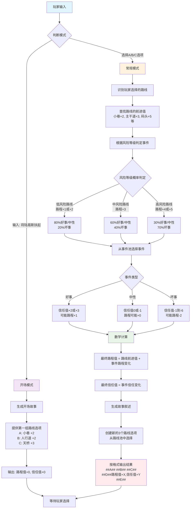

# 陆易斯游戏叙事提示词 - 流程图

## 游戏工作流程图

## 流程说明

### 游戏模式判断
- **开场模式**：玩家输入特定开场内容时触发
- **常规模式**：玩家选择具体路线选项时触发

### 数值计算公式
- **最终路程值** = 路线前进值 + 事件路程变化
- **最终信任值** = 事件信任变化（只受事件影响）

### 概率机制
- **低风险路线**（路程+1或+2）：80%概率好事，20%概率坏事
- **中风险路线**（路程+3）：60%概率好事，40%概率坏事  
- **高风险路线**（路程+4或+5）：30%概率好事，70%概率坏事

### 游戏循环
整个游戏就是一个"选择→事件→计算→新选择"的无限循环，直到达成某种结束条件。