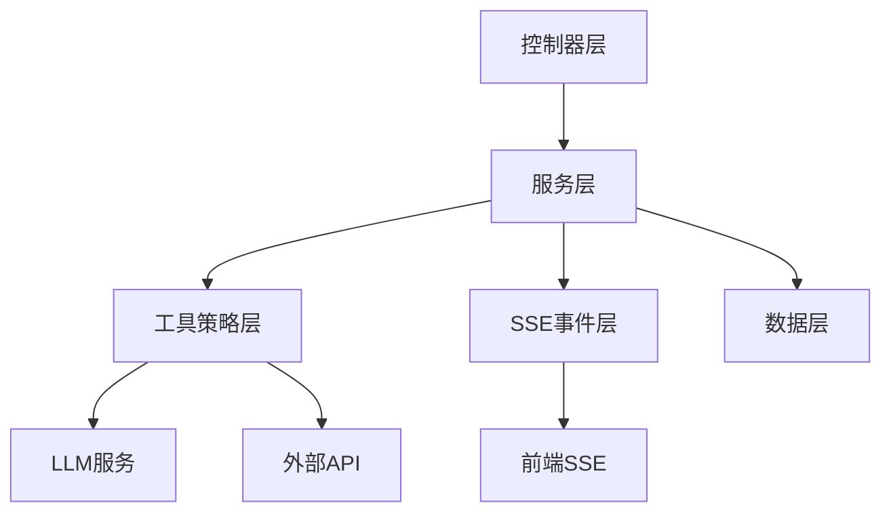

# Agent架构概览

使用策略模式执行工具和SSE实现实时流式的AI Agent平台。

## 核心设计模式

| 模式 | 用途 | 实现 |
|------|------|------|
| **策略模式** | 工具执行灵活性 | ToolStrategy接口，3种实现 |
| **门面模式** | 简化SSE操作 | PodcastEventUtil静态方法 |
| **模板方法** | 工具类型行为 | PromptToolStrategy, HybridToolStrategy |
| **工厂模式** | 组件创建 | EventUtil.createSender() |
| **仓储模式** | 数据访问抽象 | MyBatis Plus mappers |

## 系统架构

## 组件职责

| 组件 | 职责 | 核心类 |
|------|------|--------|
| **控制器** | HTTP端点，SSE设置 | PodcastChatController, AgentSessionController |
| **服务** | 业务逻辑，编排 | PodcastChatService, PodcastDocStepService |
| **工具策略** | 外部能力执行 | ToolStrategy实现类 |
| **事件系统** | 实时流式传输 | EventSender, PodcastEventSender |
| **数据访问** | 数据库操作 | Entity mappers |

## 架构原则

- **数据驱动**: 行为通过数据库配置（tools, prompts表）
- **关注点分离**: 清晰的层级边界
- **异步支持**: SSE流式 + 异步任务管理
- **版本管理**: 每次修改创建新plan_doc
- **上下文传递**: ChatContextDTO跨步骤数据共享

## 关键设计决策

| 决策 | 原因 |
|------|------|
| 单一`radio_intention`工具 | 统一所有场景的意图识别 |
| 工具策略模式 | 无需修改核心即可扩展工具类型 |
| 4层SSE架构 | 基础设施与业务事件分离 |
| 冗余数据库字段 | 查询性能优于规范化 |
| Map参数传递 | 消除JSON解析开销 |

## 入口点

- **播客生成**: `POST /agent/podcast/chat/start`
- **继续对话**: `POST /agent/podcast/chat/continue`
- **会话管理**: `/agent/session/*` 端点
- **SSE流式**: 带SseEmitter的异步方法

## 技术栈

- **后端**: Spring Boot 3, Java 17+
- **数据库**: PostgreSQL, MyBatis Plus
- **流式**: SSE (Server-Sent Events)
- **LLM集成**: OpenAI兼容API
- **异步**: Spring @Async, ThreadPoolExecutor