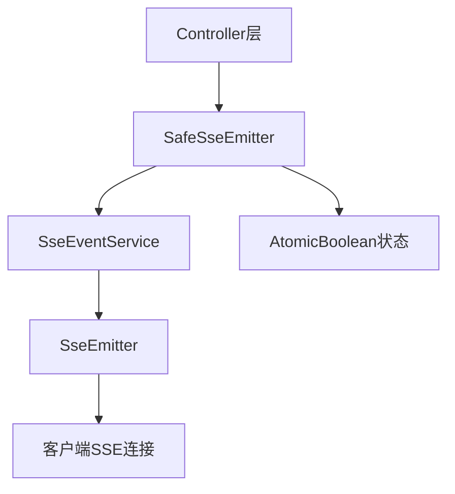

# SSE事件系统架构

具备安全性保障的SSE系统，防止重复完成错误并支持幂等操作。

## 架构设计

| 组件 | 职责 | 实现 |
|------|------|------|
| **SafeSseEmitter** | SSE安全包装器 | 防止IllegalStateException，提供幂等操作 |
| **SseEventService** | 统一的SSE事件管理 | **只接受SafeSseEmitter参数**，保证类型安全 |
| **扩展点** | 未来功能预留 | Protected方法支持继承扩展 |

**设计特点**：
- **编译时类型安全**：所有方法只接受SafeSseEmitter，无需运行时类型检查
- **线程安全**：SafeSseEmitter使用AtomicBoolean确保状态一致性
- **幂等操作**：重复调用发送或完成方法不会抛出异常
- **自动状态跟踪**：通过回调自动管理完成状态
- **零运行时开销**：消除了所有instanceof检查
- 播客和玩法共享大部分事件方法，避免重复
- 单一服务类，减少层次和复杂度

## SSE安全架构



## 事件类型参考

### 播客事件

| 事件类型 | 触发时机 | 数据结构 |
|----------|----------|----------|
| `plan_intro` | 意图识别完成 | `{intro, thinking_duration, intent_type}` |
| `plan_doc_begin` | 计划开始 | `{doc_id, title, steps[]}` |
| `plan_doc_step.begin` | 步骤开始 | `{step, step_status, step_desc}` |
| `plan_doc_step.delta` | 流式内容 | `{delta, task_id?, image_num?}` |
| `plan_doc_step.done` | 步骤完成 | `{step, step_status}` |
| `plan_error` | 错误发生 | `{dialog_id, error_code, message}` |

### 事件流示例

```
用户请求
    ↓
sendPlanIntro() → "正在分析请求..."
    ↓
sendPlanDocBegin() → 文档结构
    ↓
sendStepBegin("outline") → "正在生成大纲..."
    ↓
sendStepDelta("第一点...") → 流式内容
    ↓
sendStepDone("outline") → 步骤完成
```

## SSE安全实现

### SafeSseEmitter核心特性
```java
@Slf4j
public class SafeSseEmitter {
    private final SseEmitter emitter;
    private final AtomicBoolean completed;
    
    // 线程安全的发送方法
    public boolean safeSend(SseEmitter.SseEventBuilder event) {
        if (completed.get()) {
            log.debug("Skipping send - emitter already completed");
            return false;
        }
        // 发送逻辑...
    }
    
    // 幂等的完成方法
    public void safeComplete() {
        if (completed.compareAndSet(false, true)) {
            emitter.complete();
        }
    }
    
    // 状态检查
    public boolean isCompleted() {
        return completed.get();
    }
}
```

### SseEventService核心方法
```java
@Service
public class SseEventService {
    
    // 创建安全的SSE发射器
    public SafeSseEmitter createSafeEmitter(Long timeout) {
        return new SafeSseEmitter(timeout);
    }
    
    // 所有事件方法只接受SafeSseEmitter - 编译时类型安全
    public void sendPlanIntro(SafeSseEmitter emitter, String dialogId, String intro, 
                             int thinkingDuration, String intentType, String title);
    public void sendPlanDocBegin(SafeSseEmitter emitter, String dialogId, String docId, 
                                 String title, List<String> steps);
    public void sendStepBegin(SafeSseEmitter emitter, String step, String stepDesc);
    public void sendStepDelta(SafeSseEmitter emitter, String delta, String taskId, Integer imageNum);
    public void sendStepDone(SafeSseEmitter emitter, String step, String stepDesc);
    public void sendStepError(SafeSseEmitter emitter, String step, String stepDesc, String errorMsg);
    
    // 核心发送方法 - 简化实现，无需类型检查
    private boolean sendEvent(SafeSseEmitter emitter, String eventType, Map<String, Object> data) {
        if (emitter.isCompleted()) {
            return false;
        }
        return emitter.safeSend(buildEvent(eventType, data));
    }
}
```

## 错误处理策略

| 错误类型 | 处理方式 | 发送事件 | SafeSseEmitter优势 |
|----------|----------|----------|--------------------|
| **类型错误** | **编译时阻止** | - | **完全消除运行时类型错误** |
| **连接断开** | 日志记录&清理 | 无（客户端重连） | 自动状态跟踪，避免重复操作 |
| **重复完成** | 状态检查 | 跳过操作 | **防止IllegalStateException** |
| **业务错误** | 安全发送错误事件 | `plan_error`带详情 | 幂等发送，多层调用安全 |
| **验证错误** | HTTP 200 + JSON | 标准错误响应 | - |
| **异步失败** | 更新任务状态 | 通过轮询获取错误 | - |

## 流式优化

### StreamTokenBuffer
- 累积令牌后发送
- 减少SSE消息频率
- 可配置缓冲区大小
- 标点符号自动刷新

### 控制器使用模式
```java
@RestController
public class PodcastChatController {
    
    @PostMapping("/start")
    public SseEmitter startChat(@RequestBody PodcastStartChatRequest request) {
        // 创建安全的SSE连接
        SafeSseEmitter safeEmitter = sseEventService.createSafeEmitter(30 * 60 * 1000L);
        SseEmitter emitter = safeEmitter.getEmitter();
        
        try {
            // 异步处理 - 传递SafeSseEmitter
            podcastChatService.startChat(safeEmitter, request, userId);
        } catch (Exception e) {
            // 安全的错误处理
            if (!safeEmitter.isCompleted()) {
                safeEmitter.safeSend(SseEmitter.event()
                    .name("error")
                    .data("启动失败: " + e.getMessage()));
                safeEmitter.safeComplete();
            }
        }
        
        return emitter; // 返回Spring需要的SseEmitter
    }
}
```

### 服务层使用模式
```java
@Service
public class PodcastChatService {
    
    // 所有方法统一使用SafeSseEmitter
    public void startChat(SafeSseEmitter emitter, PodcastStartChatRequest request) {
        try {
            // 直接传递SafeSseEmitter给所有方法
            performProcessing(emitter, request);
            
            // 类型安全的完成
            sseEventService.sendPlanDone(emitter, dialogId, "处理完成");
        } catch (Exception e) {
            // 类型安全的错误处理
            sseEventService.sendPlanError(emitter, dialogId, e.getMessage());
        }
    }
    
    // 私有方法也使用SafeSseEmitter - 保持一致性
    private void performProcessing(SafeSseEmitter emitter, PodcastStartChatRequest request) {
        // 处理逻辑...
        sseEventService.sendStepBegin(emitter, "step1", "开始处理");
    }
}
```

## 最佳实践

### SafeSseEmitter架构原则
1. **控制器创建SafeSseEmitter** - 使用`sseEventService.createSafeEmitter()`
2. **业务层只用SafeSseEmitter** - 所有服务方法统一使用SafeSseEmitter
3. **编译时类型安全** - 不再需要运行时instanceof检查
4. **方法签名规范** - **所有方法（公共和私有）都使用SafeSseEmitter**

### 通用SSE实践
5. **SSE方法不抛异常** - 使用结构化错误事件
6. **单任务进行中** - 完成后再开始下一个
7. **立即状态更新** - 不要批量完成
8. **多层安全调用** - 服务的不同层都可以安全调用发送/完成方法
9. **SSE前验证** - 在控制器检查业务规则

### 错误处理模式
```java
// ✅ 推荐：类型安全的幂等错误处理
try {
    // 业务逻辑
} catch (Exception e) {
    sseEventService.sendPlanError(safeEmitter, dialogId, e.getMessage());
    // 编译时保证类型正确，运行时保证幂等
}

// ❌ 不可能：编译器会阻止错误用法
// sseEventService.sendPlanError(sseEmitter, ...); // 编译错误！

// ❌ 避免：手动状态管理
if (!emitterCompleted) {
    emitter.send(...);
    emitterCompleted = true;
}
```