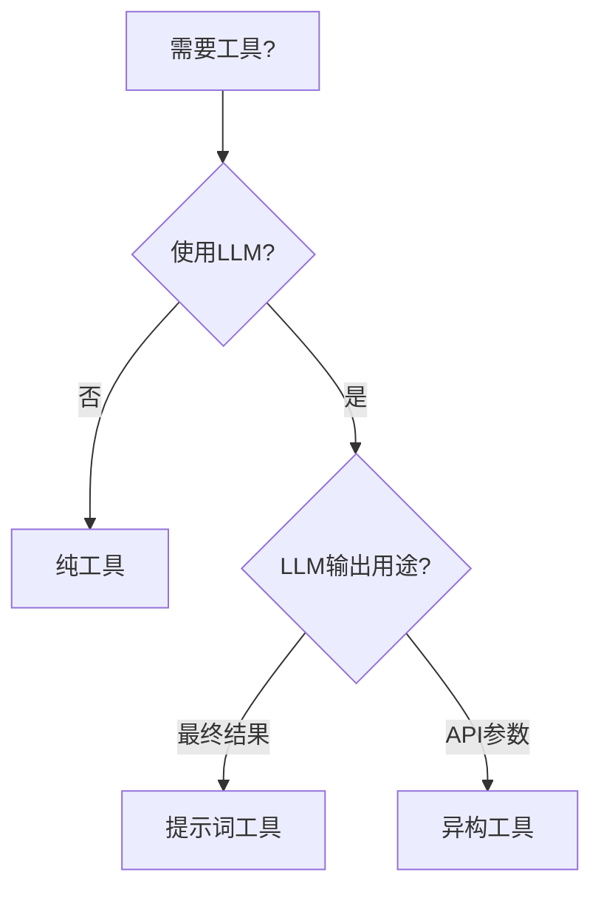
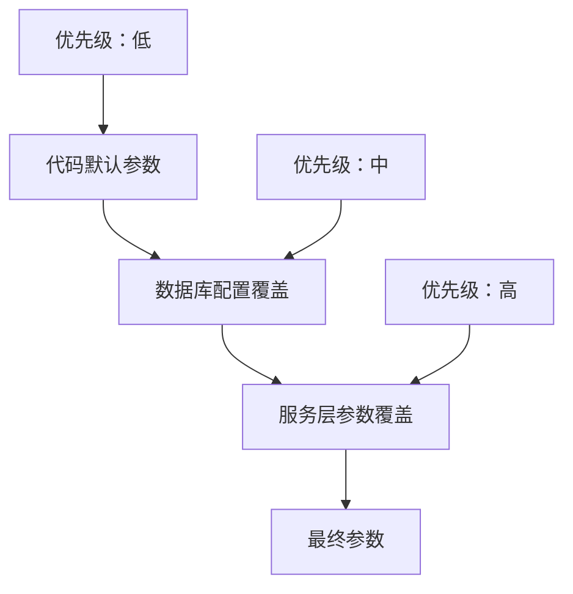

# 工具策略系统

使用策略模式的可扩展工具执行框架，包含三种不同类型。

## 工具类型对比

| 类型 | 使用LLM | LLM角色 | 使用场景 | 示例 |
|------|---------|---------|----------|------|
| **纯工具** | 否 | - | 直接API调用，确定性逻辑 | crawler_tool |
| **提示词工具** | 是 | **生成最终结果** | 内容创作，分析 | radio_intention, radio_script |
| **异构工具** | 是 | **准备API参数** | 多步骤：LLM → API | radio_cover, radio_bgm |

## 工具类型决策指南



## 实现结构

### 基础接口
```java
public interface ToolStrategy {
    String getToolCode();
    String getToolType(); // 返回 ToolConstant.PURE_TOOL/PROMPT_TOOL/HYBRID_TOOL
    boolean isAsync();
    ExecutionResult execute(Map<String, Object> parameters, 
                          ToolExecutionContextDTO context, 
                          Consumer<String> tokenConsumer); // null时非流式，非null时流式
}
```

### 工具注册
Spring自动发现并注册所有`@Component`实现：
```java
@Service
public class ToolService {
    private final Map<String, ToolStrategy> strategyMap; // Spring自动注入
}
```

## 工具类型详解

### 纯工具策略
```java
@Component
public class CrawlerToolStrategy implements ToolStrategy {
    public ExecutionResult execute(Map<String, Object> params, ...) {
        String url = (String) params.get("url");
        // 直接API调用，不涉及LLM
        return ExecutionResult.success(crawlWebsite(url));
    }
}
```

### 提示词工具策略
```java
public abstract class PromptToolStrategy implements ToolStrategy {
    protected abstract String getPromptCode();
    
    public ExecutionResult execute(Map<String, Object> params, 
                                 ToolExecutionContextDTO context,
                                 Consumer<String> tokenConsumer) {
        // 根据tokenConsumer决定执行模式
        if (tokenConsumer != null) {
            // 流式执行
            String result = promptService.executeStreamPrompt(getPromptCode(), params, tokenConsumer);
            return ExecutionResult.success(result);
        } else {
            // 非流式执行
            String result = promptService.executePrompt(getPromptCode(), params);
            return ExecutionResult.success(result);
        }
    }
}
```

### 异构工具策略
```java
public abstract class HybridToolStrategy implements ToolStrategy {
    protected abstract String getPromptCode();
    protected abstract Object callThirdPartyAPI(String llmResponse);
    
    public ExecutionResult execute(Map<String, Object> params, ...) {
        // 步骤1：LLM准备API参数
        String llmResponse = promptService.executePrompt(getPromptCode(), params);
        // 步骤2：调用外部API
        Object apiResult = callThirdPartyAPI(llmResponse);
        return ExecutionResult.success(apiResult);
    }
}
```

## 执行流程示例

### 封面生成（异构工具）
```
输入：播客大纲
  ↓
LLM：生成图片描述
  ↓
解析：从LLM响应提取描述
  ↓
API：调用文生图服务
  ↓
输出：图片URL
```

### 意图识别（提示词工具）
```
输入：用户消息 + 历史
  ↓
LLM：分析意图 (new_plan/modify_step/chat_only)
  ↓
输出：意图分类结果
```

## 数据库模式

```sql
CREATE TABLE tools (
    id CHAR(24) PRIMARY KEY,
    tool_code VARCHAR(50) UNIQUE NOT NULL,
    tool_type VARCHAR(20) NOT NULL, -- pure_tool/prompt_tool/hybrid_tool
    prompt_code VARCHAR(50), -- prompt_tool和hybrid_tool必需
    is_async TINYINT(1) DEFAULT 0,
    parameters_json JSON
);
```

## 异步工具支持

| 工具 | 异步 | 返回值 | 示例 | 特殊处理 |
|------|------|--------|------|----------|
| radio_cover | 是 | task_id | 封面生成 | - |
| radio_bgm | 是 | task_id | 音乐生成 | - |
| radio_script | 否 | 脚本内容 | 实时流式 | - |
| radio_mp3 | 是 | task_id | 音频生成 | PENDING→PROCESSING两阶段 |

### 音频生成特殊流程
音频生成使用两阶段异步任务，解决LLM转换超时问题：
1. **PENDING阶段**：LLM转换脚本为音频参数（5分钟超时）
2. **PROCESSING阶段**：调用第三方API生成音频（3分钟超时）

```
创建任务(PENDING) → LLM转换 → 存储元数据 → 调用API → 更新为PROCESSING → 轮询结果
```

## 流式输出

通过`tokenConsumer`参数控制执行模式：
- `tokenConsumer = null`：阻塞执行，返回完整结果
- `tokenConsumer != null`：流式执行，实时推送token
- 适用所有提示词工具，无需配置
- 调用方决定是否需要流式输出

## 参数处理

### 高层设计原则
- **零硬编码**: 使用Jackson ObjectMapper实现Object ↔ Map转换
- **通用泛型**: 支持任意参数类型，不限于特定工具
- **类型安全**: 编译时类型检查，运行时自动转换
- **三层覆盖**: 服务层 > 数据库配置 > 代码默认值

### 核心参数解析（通用方法）
```java
// 高层设计：通用参数解析，适用于任何参数类型
public static <T> T resolveParameters(Tools tool, 
                                    Map<String, Object> serviceParameters, 
                                    T codeDefaults, 
                                    Class<T> targetClass) {
    // 1. 使用JsonUtil将对象转为Map（零硬编码）
    Map<String, Object> codeDefaultsMap = JsonUtil.convertToMap(codeDefaults);
    
    // 2. 应用三层覆盖机制
    Map<String, Object> resolvedParams = resolveParameters(
            serviceParameters,
            tool != null ? tool.getConfigJson() : null,
            codeDefaultsMap);
    
    // 3. 使用JsonUtil将Map转回目标类型（零硬编码）
    return JsonUtil.convertToObject(resolvedParams, targetClass);
}
```

### 三层参数覆盖机制


### 参数传递流程
1. **服务层**: 通过`ToolExecutionContextDTO.toolParameters`传递
2. **数据库层**: 存储在`tools.config_json`字段
3. **代码层**: 策略类中定义默认参数对象

### 使用示例（图片生成）
```java
// 代码默认参数
ImageGenerationParameters codeDefaults = ImageGenerationParameters.builder()
    .pipeId("default-pipe-id")
    .ratio("800*800")
    .num(1)
    .build();

// 服务层参数（可选）
Map<String, Object> serviceParams = Map.of(
    "ratio", "1024*1024",
    "num", 2
);

// 通用参数解析
ImageGenerationParameters params = ToolConfigJsonUtil.resolveParameters(
    tool, serviceParams, codeDefaults, ImageGenerationParameters.class
);
// 结果：pipeId来自默认值，ratio和num被服务层覆盖
```