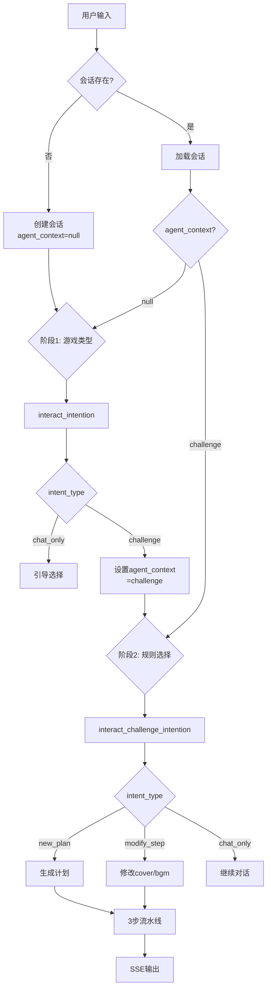

# 玩法Agent设计文档

游戏化对话系统，提供挑战机制、动态内容生成和个性化体验。

## 业务流程



## 两阶段意图识别

### 阶段1：游戏类型选择
- **工具**: `interact_intention`
- **触发**: 当`agent_context`为null
- **输出**: 游戏类型（challenge/story/chatroom）
- **更新**: 设置`agent_context`到会话

### 阶段2：挑战规则选择
- **工具**: `interact_challenge_intention`
- **触发**: 当`agent_context == "challenge"`
- **输出**: 具体模板 + 意图
- **模板**:

| 代码 | 名称 | 机制 |
|------|------|------|
| judge_10r | 心理判断挑战 | 10回合识别动机 |
| love_3m | 限时好感挑战 | 3分钟提升至满分 |
| love_20r | 深度情感攻略 | 20回合心理突破 |
| switch_persona | 人设解锁挑战 | 解锁隐藏人设 |
| timed_goal | 目标说服挑战 | 限时说服达成目标 |

## 文档生成流水线

| 步骤 | 工具 | 类型 | 模式 | 输出 |
|------|------|------|------|------|
| plan_plot | 模板专属工具 | Prompt | 流式 | 挑战规则MD |
| plan_cover | interact_cover | Hybrid | 异步 | task_id → 图片 |
| plan_bgm | interact_bgm | Hybrid | 异步 | task_id → 音频 |

### 动态步骤命名
- **工具**: `interact_step_name`
- **缓存**: Caffeine（2小时TTL，最大1000条）
- **回退**: 失败时使用默认名称
- **示例输出**:
```json
{
  "plot_step": "制定李白攻略计划",
  "cover_step": "绘制诗仙风采图",
  "bgm_step": "谱写古风雅韵曲"
}
```

## 修改约束

| 步骤 | 可修改 | 原因 |
|------|--------|------|
| plan_plot | ❌ | 核心规则影响其他步骤 |
| plan_cover | ✅ | 视觉定制 |
| plan_bgm | ✅ | 音频定制 |

修改创建新PlanDoc版本，复用plot内容。

## SSE事件序列

```
response.plan.begin
├── response.plan_intro (2次: 游戏类型，然后规则)
├── response.plan_doc.begin
├── response.plan_doc_step.begin (plot)
│   └── response.plan_doc_step.delta (流式)
│       └── response.plan_doc_step.done
├── response.plan_doc_step.begin (cover)
│   └── response.plan_doc_step.delta (taskId)
│       └── response.plan_doc_step.done
├── response.plan_doc_step.begin (bgm)
│   └── response.plan_doc_step.delta (taskId)
│       └── response.plan_doc_step.done
├── response.plan_doc.done
├── response.plan_summary.*
└── response.plan.done
```

## 服务架构

### InteractChatService
- `startChat()`: 初始化会话，阶段1意图
- `continueChat()`: 按agent_context路由
- `processFirstStage()`: 游戏类型选择
- `processSecondStage()`: 挑战规则选择
- `generateInteractPlan()`: 执行3步流水线

### InteractDocStepService
- `generateDynamicStepNames()`: 缓存个性化名称
- `executePlanPlot()`: 流式挑战规则
- `executePlanCover/Bgm()`: 异步生成
- `cleanupContext()`: 清理步骤名称缓存

## 工具实现

### 11个工具策略（全部PromptToolStrategy）
| 类别 | 工具 | 用途 |
|------|------|------|
| 意图 | interact_intention, interact_challenge_intention | 两阶段识别 |
| 规则 | 5个挑战模板 (judge_10r, love_3m等) | 规则生成 |
| 资源 | interact_cover, interact_bgm | 视觉/音频生成 |
| 工具 | interact_step_name, interact_convert_template | 支持功能 |

### 工具配置
所有工具使用数据库config_json配置参数：
```json
{
  "num": 1,
  "ratio": "800*800",
  "pipeId": "000004599173902571683851"
}
```

## API端点

### 开始交互
```
POST /agent/interact/start
SSE响应

请求: {
  "userId": "xxx",
  "prompt": "用户输入",
  "characterId": "xxx",
  "character": {...}
}
```

### 继续交互
```
POST /agent/interact/continue
SSE响应

请求: {
  "sessionId": "xxx",
  "prompt": "用户输入"
}
```

## 数据模型

使用标准agent表，玩法特定字段：
- `plan_session.plan_type`: "interact"
- `plan_session.agent_context`: 游戏类型（challenge/story/chatroom）
- `plan_session.context_metadata`: 角色信息JSON
- `plan_doc.doc_type`: 模板代码（如"love_3m"）

## 缓存策略

### 步骤名称缓存
- **实现**: Caffeine
- **键**: `sessionId_dialogId`
- **TTL**: 2小时
- **大小**: 最大1000条
- **用途**: 跨步骤持久化动态名称

## 流式处理

- **StreamTokenBuffer**: 字符级缓冲
- **刷新触发**: 标点符号或缓冲区限制
- **集成**: 所有plot生成使用流式

## 关键特性

- **两阶段意图**: 从游戏类型逐步缩小到具体规则
- **动态命名**: 每个挑战个性化步骤描述
- **选择性修改**: 仅视觉/音频可定制，核心规则不变
- **模板驱动**: 5种预定义挑战类型，可扩展
- **缓存优化**: Caffeine实现跨步骤数据持久化

## 扩展点

- **新游戏类型**: 添加到agent_context枚举
- **新挑战**: 添加模板 + 工具策略
- **新资源**: 遵循Hybrid工具模式
- **常量**: 集中在AgentConstant/ToolConstant