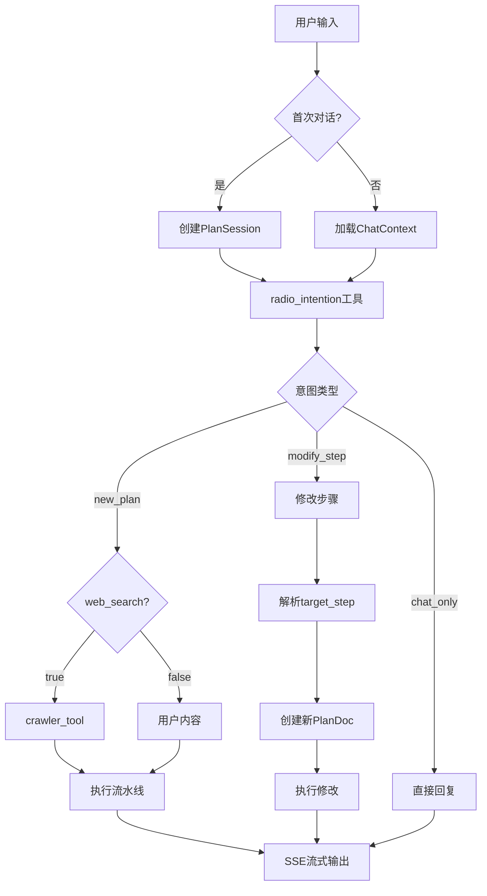

# 播客Agent设计文档

自动化播客生成系统，具备意图识别、内容创作和音频合成能力。

## 业务流程



## 流水线步骤

| 步骤 | 工具 | 类型 | 模式 | 输出 |
|------|------|------|------|------|
| plan_intro | radio_intention + crawler_tool | Prompt + Pure | 同步 | 意图识别 |
| plan_outline | radio_outline | Prompt | 同步+流式 | 播客结构 |
| plan_cover | radio_cover | Hybrid | 异步 | task_id → 图片URL |
| plan_bgm | radio_bgm | Hybrid | 异步 | task_id → 音频URL |
| plan_script | radio_script | Prompt | 同步+流式 | 对话脚本 |
| plan_summary | - | 直接 | 同步 | 摘要文本 |
| plan_generate_mp3 | radio_mp3 | Hybrid | 异步两阶段 | PENDING→PROCESSING→音频 |

## 意图识别

**工具**: `radio_intention`（所有场景的单一入口）

**输出结构**:
```json
{
  "intent_type": "new_plan/modify_step/chat_only",
  "target_step": "plan_cover,plan_bgm", // 逗号分隔多步骤
  "web_search": "true/false",
  "title": "15字内标题",
  "summary": "200-500字摘要"
}
```

**多步骤修改**:
- 解析：按逗号分割，去除空格
- 验证：检查每个步骤有效性
- 顺序：按cover → bgm → script执行
- 容错：单个失败继续其他步骤

## 版本管理

| 操作 | 行为 | PlanDoc |
|------|------|---------|
| new_plan | 完整流水线执行 | 新v1包含所有步骤 |
| modify_step | 部分执行 | 新v2仅包含修改步骤 |
| 查询 | 智能合并 | 基础文档+修改内容 |

## SSE事件

### 事件流
```
response.plan.begin
├── response.plan_intro (意图结果)
├── response.plan_doc.begin
├── response.plan_doc_step.begin
├── response.plan_doc_step.delta (流式)
├── response.plan_doc_step.done
├── response.plan_doc.done
├── response.plan_summary.*
└── response.plan.done
```

### 异步处理
```javascript
// 异步任务开始
event: response.plan_doc_step.delta
data: {"delta": "", "taskId": "123", "imageNum": 1}

// 步骤标记完成，通过taskId轮询结果
event: response.plan_doc_step.done
data: {"step": "plan_cover", "step_status": "10"}
```

## 服务架构

### PodcastChatService
- `startChat()`: 创建会话，按意图路由
- `continueChat()`: 加载上下文，处理输入
- `performFirstIntentRecognition()`: 调用radio_intention
- 意图路由：new_plan → 完整流水线，modify_step → 部分执行

### PodcastDocStepService  
- `executeFullPlan()`: 6步流水线编排
- `executePlanIntro()`: 意图+可选爬虫
- `executePlanOutline/Script()`: 支持流式生成
- `modifyStep()`: 单/多步骤修改支持

### PodcastAudioService
两阶段异步管理超时：
1. PENDING：LLM转换脚本为参数（5分钟超时）
2. PROCESSING：调用TTS API（3分钟超时）
3. 元数据存储在async_tasks.execution_metadata

## 工具策略

| 类型 | LLM使用 | 示例 | 模式 |
|------|---------|------|------|
| Pure | 无 | crawler_tool | 直接API/逻辑 |
| Prompt | 生成结果 | radio_outline, radio_script | LLM → 结果 |
| Hybrid | 生成参数 | radio_cover, radio_bgm | LLM → 参数 → API |

### 流式支持
- 方法重载支持`Consumer<String> tokenConsumer`
- null消费者 = 阻塞，非null = 流式
- 适用所有Prompt工具

## API端点

### 开始对话
```
POST /agent/podcast/chat/start
SSE响应

请求: {
  "prompt": "用户输入",
  "hostInfo": {...},
  "guestInfo": {...}
}
```

### 继续对话
```
POST /agent/podcast/chat/continue
SSE响应

请求: {
  "sessionId": "xxx",
  "prompt": "用户输入"
}
```

### 会话管理
- `/agent/session/list`: 分页会话列表
- `/agent/session/document`: 获取合并文档
- `/agent/session/history`: 游标分页聊天历史

## 数据模型

### 核心表
- `plan_session`: 用户会话，包含session_name
- `dialogue_turn`: 聊天历史，包含intent_type
- `plan_doc`: 版本化文档
- `plan_doc_step`: 步骤内容，冗余字段优化性能
- `async_tasks`: 任务跟踪，状态生命周期

### 查询优化
plan_doc_step中的冗余字段：
- `dialogue_turn_id`: 避免plan_doc连接
- `plan_session_id`: 直接会话查询
结果：90%查询性能提升

## 错误处理

| 错误类型 | 策略 |
|----------|------|
| 意图识别失败 | 友好拒绝并提供引导 |
| 爬虫超时 | 跳过，使用用户输入 |
| 工具失败 | 默认内容回退 |
| 异步任务失败 | 默认资源，继续流程 |

## 关键特性

- **智能爬取**: 仅当web_search=true时触发
- **真流式**: LLM token直接推送via SSE
- **并行异步**: 封面/BGM不阻塞流水线
- **版本不可变**: 每次修改创建新版本
- **会话命名**: AI生成标题更清晰

## 实现要点

- 单一`radio_intention`工具处理所有意图场景
- ChatContext在步骤间传递数据
- 角色信息作为系统消息注入
- FlowSender用于测试，静态方法用于生产
- SafeSseEmitter确保类型安全防止重复完成