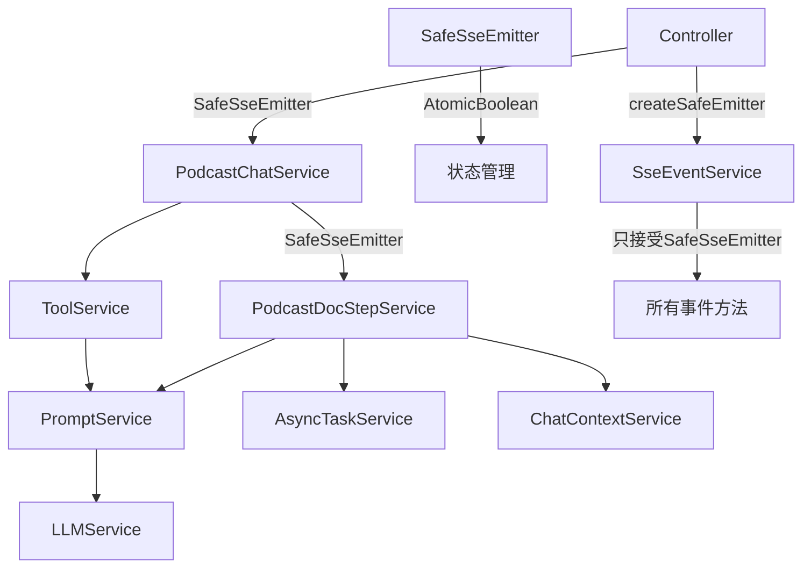

# 服务组件指南

核心服务组件及其交互模式的详细说明。

## 服务依赖关系与SafeSseEmitter



## 核心服务职责

| 服务 | 职责 | 关键方法 |
|------|------|----------|
| **PodcastChatService** | 对话管理（SafeSseEmitter） | startChat, continueChat |
| **PodcastDocStepService** | 播客生成流程 | executeFullPlan, modifyStep |
| **PodcastAudioService** | 音频生成（PENDING→PROCESSING） | generateAudio, generateAudioAsync |
| **ToolService** | 工具执行 | executeTool, isAsyncTool |
| **PromptService** | 提示词处理 | buildPrompt, executePrompt |
| **LLMService** | 模型调用 | call, callStream |
| **ChatContextService** | 上下文管理 | buildContext, getLatestStep |
| **AsyncTaskService** | 异步任务 | createTask, completeTask, createTaskWithStatus, updateTaskToProcessing |

## SafeSseEmitter使用模式

### 控制器层模式
```java
@RestController
public class PodcastChatController {
    
    @PostMapping("/start")
    public SseEmitter startChat(@RequestBody PodcastStartChatRequest request) {
        // 1. 创建安全的SSE连接
        SafeSseEmitter safeEmitter = sseEventService.createSafeEmitter(30 * 60 * 1000L);
        SseEmitter emitter = safeEmitter.getEmitter();
        
        try {
            // 2. 传递给服务层
            podcastChatService.startChat(safeEmitter, request, userId);
        } catch (Exception e) {
            // 3. 安全的错误处理
            if (!safeEmitter.isCompleted()) {
                safeEmitter.safeSend(SseEmitter.event().name("error").data(e.getMessage()));
                safeEmitter.safeComplete();
            }
        }
        
        return emitter;
    }
}
```

### 服务层方法签名规范（更新后）
- **所有方法**：统一使用`SafeSseEmitter`参数
- **类型安全**：编译时保证类型正确
- **无需转换**：直接传递SafeSseEmitter，无需`.getEmitter()`

## 服务实现细节（更新后）

### PodcastChatService（统一SafeSseEmitter）
```java
@Service
public class PodcastChatService {
    // 所有方法统一使用SafeSseEmitter
    public void startChat(SafeSseEmitter emitter, PodcastStartChatRequest request, String userId) {
        String sessionId = null;
        String dialogId = null;
        
        try {
            // 1. 创建会话和对话轮次
            sessionId = createPlanSession(request, userId);
            dialogId = createDialogueTurn(sessionId, request.getPrompt());
            
            // 2. 发送计划开始事件
            sseEventService.sendPlanBegin(emitter, sessionId, dialogId);
            
            // 3. 执行意图识别（直接传递SafeSseEmitter）
            PodcastIntentResult intent = performFirstIntentRecognition(
                request.getPrompt(), emitter, dialogId);
            
            // 4. 根据意图路由
            if (INTENT_NEW_PLAN.equals(intent.getType())) {
                handleNewPlanIntent(emitter, sessionId, dialogId, request, intent);
            }
            
            // 5. 类型安全的完成
            sseEventService.sendPlanDone(emitter, dialogId, "对话处理完成");
            
        } catch (Exception e) {
            // 类型安全的错误处理
            if (dialogId != null) {
                sseEventService.sendPlanError(emitter, dialogId, "对话处理失败: " + e.getMessage());
            }
        }
    }
    
    // 私有方法也使用SafeSseEmitter - 保持一致性
    private PodcastIntentResult performFirstIntentRecognition(String userInput, SafeSseEmitter emitter, String dialogId) {
        // 意图识别逻辑...
        sseEventService.sendStepBegin(emitter, "intent", "正在识别意图");
        return intentResult;
    }
}
```

### PodcastDocStepService（统一SafeSseEmitter）
```java
@Service
public class PodcastDocStepService {
    // 完整播客生成流程 - 只接受SafeSseEmitter
    public String executeFullPlan(SafeSseEmitter emitter, String sessionId, 
                                 String dialogId, PodcastStartChatRequest request, 
                                 ChatContextDTO chatContext, PodcastIntentResult intentResult) {
        try {
            // 步骤1: 意图识别和内容获取
            executePlanIntro(emitter, dialogId, request, intentResult);
            
            // 步骤2: 生成大纲
            executePlanOutline(emitter, dialogId, docId, sessionId);
            
            // 步骤3-4: 异步生成封面和BGM
            executePlanCover(emitter, dialogId, docId, sessionId);
            executePlanBgm(emitter, dialogId, docId, sessionId);
            
            // 步骤5: 生成脚本（流式输出）
            executePlanScript(emitter, dialogId, docId, sessionId);
            
            return docId;
        } catch (Exception e) {
            // 类型安全的错误处理
            sseEventService.sendPlanError(emitter, dialogId, "播客生成失败: " + e.getMessage());
            throw e;
        }
    }
    
    // 所有私有方法也使用SafeSseEmitter
    private void executePlanIntro(SafeSseEmitter emitter, String dialogId, 
                                  PodcastStartChatRequest request, PodcastIntentResult intentResult) {
        // 处理逻辑...
    }
}
```

### ToolService
- 执行工具策略
- 参数：toolCode, params, context, tokenConsumer
- 返回：ExecutionResult

### AsyncTaskService增强
新增方法：
- `createTaskWithStatus(taskId, triggeredBy, metadata, status)` - 创建PENDING/PROCESSING任务
- `updateTaskToProcessing(taskId)` - PENDING→PROCESSING状态转换
- `updateTaskExecutionMetadata(taskId, metadata)` - 存储LLM转换结果
- `getPendingAndProcessingTasksByTrigger(triggeredBy)` - 查询未完成任务

### PodcastAudioService
音频生成两阶段流程：
1. **生成任务**：createTaskWithStatus创建PENDING任务，立即返回taskId
2. **异步执行**：
   - LLM转换脚本→音频参数
   - updateTaskExecutionMetadata存储转换结果
   - 调用第三方API
   - updateTaskToProcessing更新状态
   - 创建或更新plan_generate_mp3步骤

## 上下文传递模式

### ChatContextDTO结构
```java
public class ChatContextDTO {
    private String sessionId;
    private String dialogId;
    private List<MessageDTO> messages;  // 对话历史
    private Map<String, Object> stepData; // 步骤数据
}
```

### 跨步骤数据共享
```java
// 构建上下文
ChatContextDTO context = chatContextService.buildContext(sessionId);

// 获取前置步骤数据
PlanDocStep outlineStep = chatContextService.getLatestStepBySessionId(
    sessionId, StepConstant.PLAN_OUTLINE);

// 添加到上下文
context.addStepData("outline", outlineStep.getContent());

// 传递给下一步骤
toolService.executeTool(toolCode, params, context, tokenConsumer);
```

## 流式处理模式

### LLM流式调用
```java
public String callStream(String prompt, Consumer<String> tokenConsumer) {
    StringBuilder fullResponse = new StringBuilder();
    
    // 建立SSE连接
    try (Response response = httpClient.newCall(request).execute()) {
        // 逐令牌处理
        while (!source.exhausted()) {
            String token = parseStreamToken(data);
            if (token != null) {
                fullResponse.append(token);
                tokenConsumer.accept(token); // 实时推送
            }
        }
    }
    
    return fullResponse.toString(); // 返回完整结果
}
```

### 令牌缓冲优化
```java
StreamTokenBuffer buffer = new StreamTokenBuffer(100); // 100字符缓冲

promptService.executeStreamPrompt(promptCode, params, token -> {
    buffer.append(token);
    if (buffer.shouldFlush()) {
        sender.sendStepDelta(dialogId, buffer.flush(), null);
    }
});
```

## 模型选择机制

```java
// ModelApiConfig
public static String getModel(String promptCode, String defaultModel) {
    // 特殊模型映射
    Map<String, String> SPECIAL_MODELS = Map.of(
        "radio_intention", "ep-20250122142510-jrcvh" // 高性能模型
    );
    
    return SPECIAL_MODELS.getOrDefault(promptCode, defaultModel);
}

// 使用示例
String model = ModelApiConfig.getModel(promptCode, defaultModel);
```

## 错误处理最佳实践（SafeSseEmitter增强）

| 场景 | 处理方式 | 示例 | SafeSseEmitter优势 |
|------|----------|------|--------------------|  
| **类型错误** | **编译时阻止** | 错误类型参数 | **完全消除运行时类型错误** |
| **业务验证** | 抛出BusinessException | 参数校验失败 | - |
| **SSE方法** | 安全发送错误事件 | 步骤执行失败 | **幂等操作，多层调用安全** |
| **异步任务** | 更新任务状态 | API调用超时 | - |
| **重复完成** | 自动检查状态 | 多服务层调用 | **防止IllegalStateException** |

### SafeSseEmitter错误处理模式

```java
// ✅ 推荐：类型安全的幂等错误处理
try {
    // 业务逻辑
    performBusinessLogic();
} catch (Exception e) {
    // 编译时保证类型正确
    sseEventService.sendPlanError(safeEmitter, dialogId, e.getMessage());
    // 再次调用也安全
    sseEventService.sendPlanError(safeEmitter, dialogId, "额外错误信息");
}

// ❌ 不可能：编译器会阻止错误用法
// sseEventService.sendPlanError(sseEmitter, ...); // 编译错误！

// ❌ 避免：手动状态管理
boolean emitterCompleted = false;
if (!emitterCompleted) {
    emitter.send(...);
    emitterCompleted = true; // 手动管理容易出错
}

// ✅ SafeSseEmitter自动处理
if (!safeEmitter.isCompleted()) {
    safeEmitter.safeSend(SseEmitter.event().data("数据"));
    safeEmitter.safeComplete(); // 重复调用安全
}
```
| **资源清理** | SafeSseEmitter自动管理 | 自动状态跟踪与清理 |

## 流式处理与SafeSseEmitter集成

### Token消费者类型安全模式
```java
// 在服务层创建token消费者 - 类型安全
Consumer<String> tokenConsumer = token -> {
    try {
        // 编译时保证emitter是SafeSseEmitter
        sseEventService.sendStepDelta(safeEmitter, token);
    } catch (Exception e) {
        log.error("发送流式数据失败", e);
        // 不中断流式处理，流式输出继续
    }
};

// 更简单的方式：使用flushableBuffered包装
Consumer<String> safeTokenConsumer = StreamTokenBuffer.flushableBuffered(
    delta -> sseEventService.sendStepDelta(safeEmitter, delta)
);

// ❌ 不可能：编译器会阻止错误用法
// Consumer<String> badConsumer = token -> {
//     sseEventService.sendStepDelta(sseEmitter, token); // 编译错误！
// };
```

### LLM流式调用与类型安全SSE
```java
public String callStream(String prompt, Consumer<String> tokenConsumer) {
    StringBuilder fullResponse = new StringBuilder();
    
    try (Response response = httpClient.newCall(request).execute()) {
        while (!source.exhausted()) {
            String token = parseStreamToken(data);
            if (token != null) {
                fullResponse.append(token);
                // tokenConsumer只能接受SafeSseEmitter - 编译时保证
                tokenConsumer.accept(token);
            }
        }
    }
    
    return fullResponse.toString();
}

// Token消费者创建 - 类型安全
private Consumer<String> createTokenConsumer(SafeSseEmitter emitter) {
    return token -> {
        // 编译时保证emitter是SafeSseEmitter
        sseEventService.sendStepDelta(emitter, token);
    };
}
```

## Intent Result Classes

Intent recognition is a core feature of the agent system. Different agent types have specialized intent result classes that extend from a common base:

| Class | Purpose | Key Fields | Usage |
|-------|---------|------------|-------|
| **IntentResultBase** | Base class for all intent results | `intentType` - Intent classification<br>`naturalResponse` - Natural language response<br>`title` - Title for session/document<br>`summary` - Content summary<br>`targetStep` - Target step for modifications | Abstract base class providing common fields |
| **PodcastIntentResult** | Podcast-specific intent result | Inherits all base fields<br>Adds: `webSearchStr` - String field for web search flag<br>Helper: `isNeedWebSearch()` - Boolean getter<br>Helper: `setNeedWebSearch(boolean)` - Boolean setter | Used in PodcastChatService for podcast intent recognition |
| **InteractIntentResult** | Interact-specific intent result | Inherits all base fields<br>Adds: `template` - Challenge template type | Used in InteractChatService for interactive challenge intent recognition |

### Class Hierarchy
```
IntentResultBase (abstract)
├── PodcastIntentResult
└── InteractIntentResult
```

### Usage Example
```java
// In PodcastChatService
PodcastIntentResult intentResult = performFirstIntentRecognition(userInput, emitter, dialogId);
if (intentResult.isNeedWebSearch()) {
    // Execute web search logic
}

// In InteractChatService  
InteractIntentResult intentResult = performIntentRecognition(userInput, emitter, dialogId);
String template = intentResult.getTemplate(); // e.g., "judge_10r", "love_3m"
```