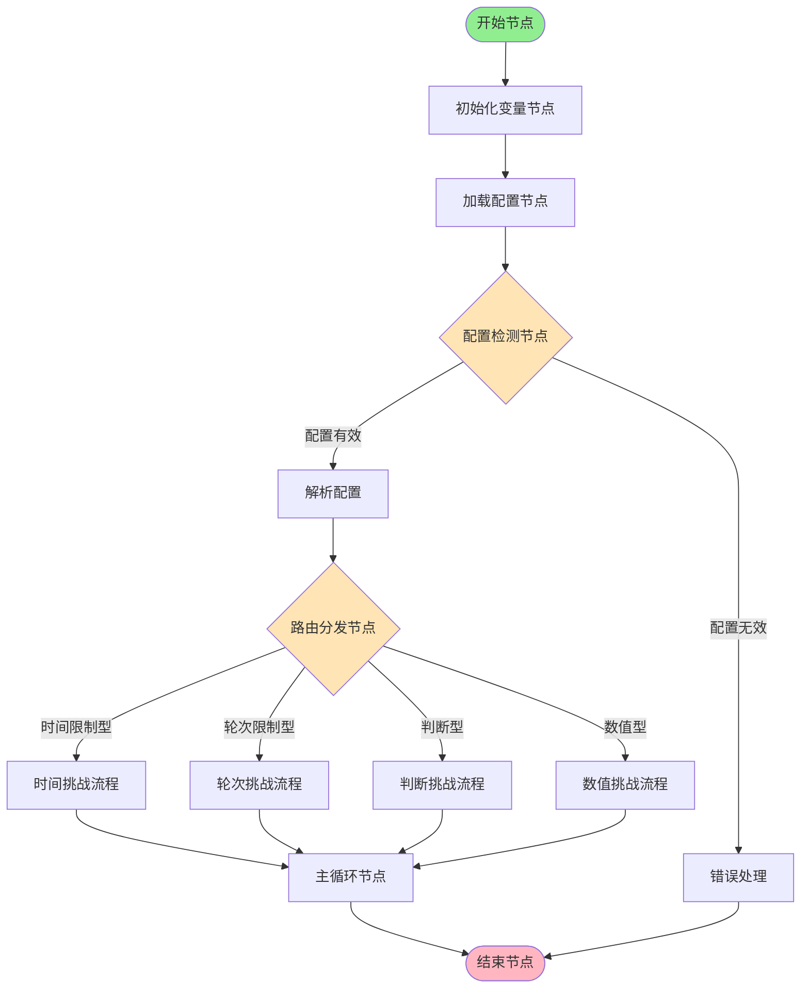
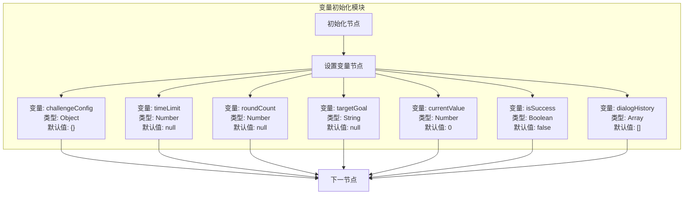
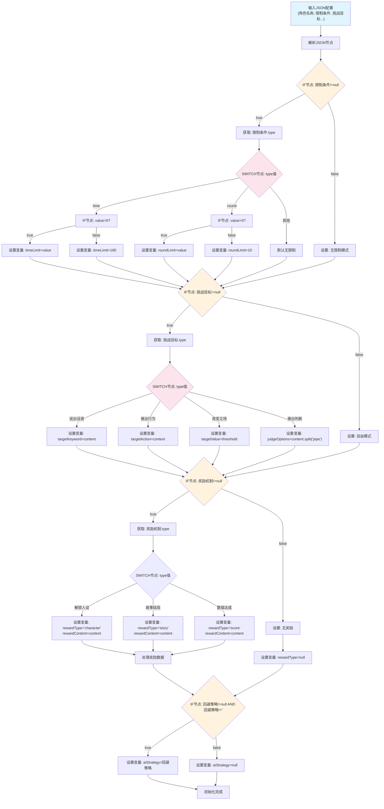
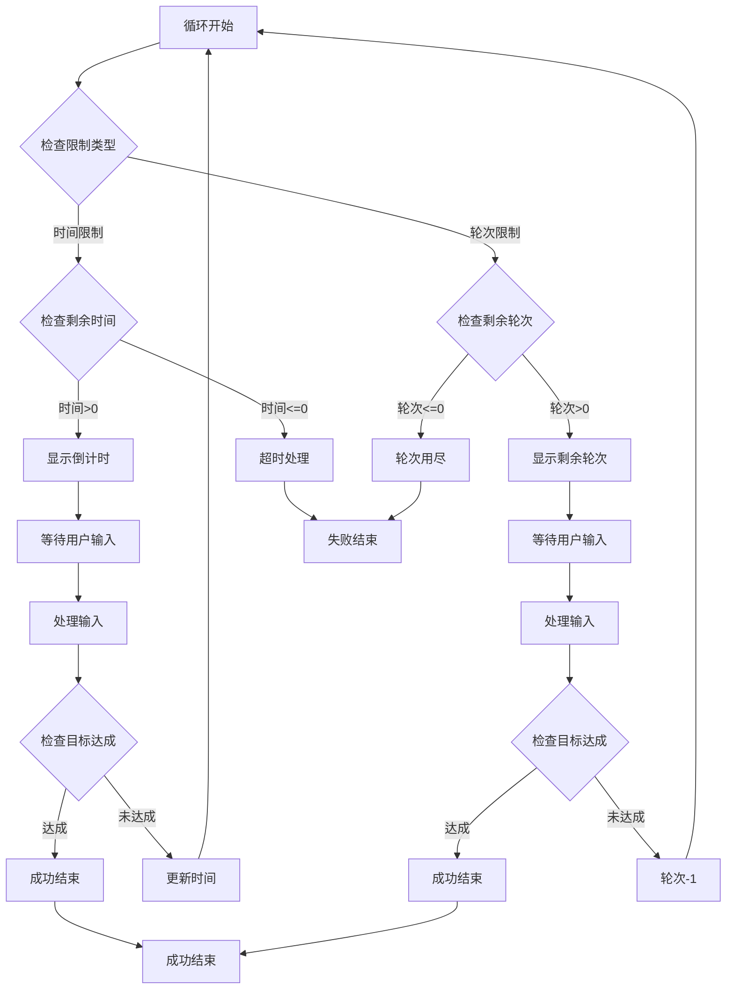
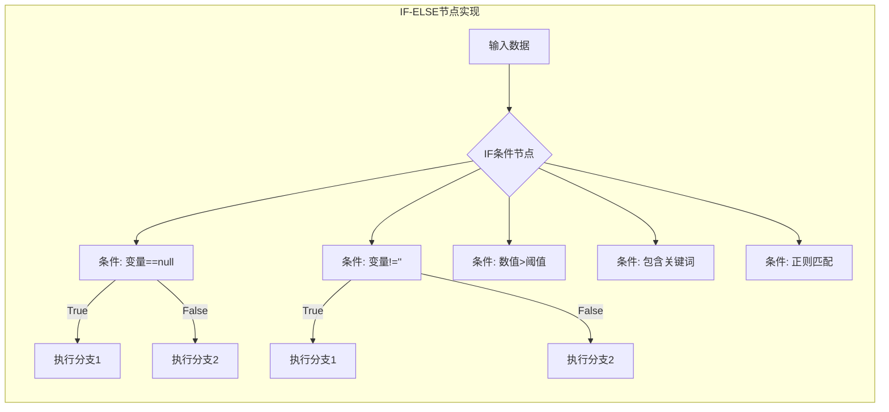
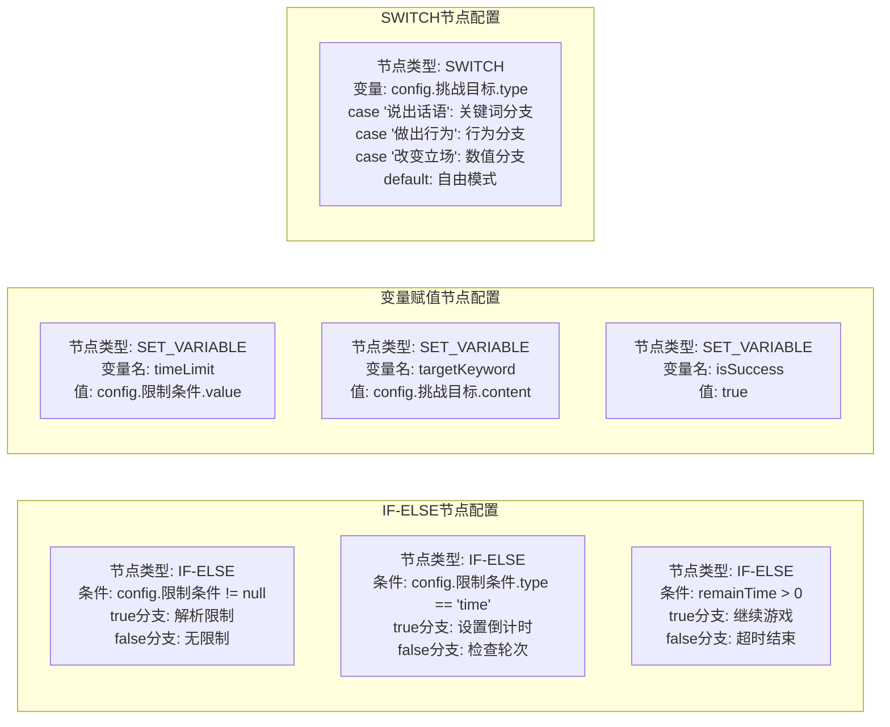
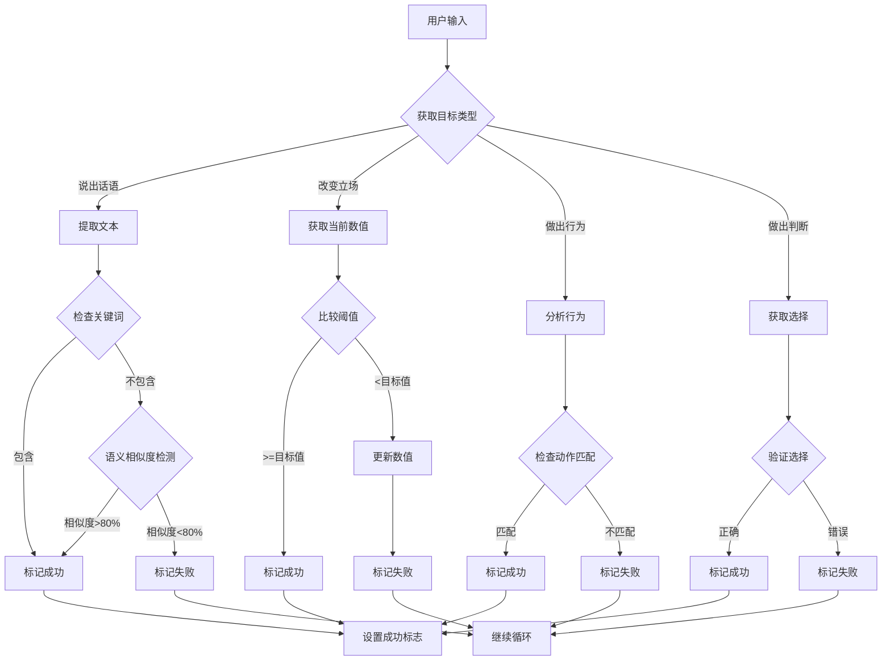
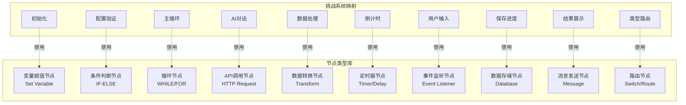
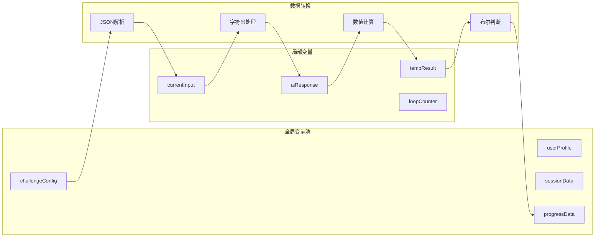
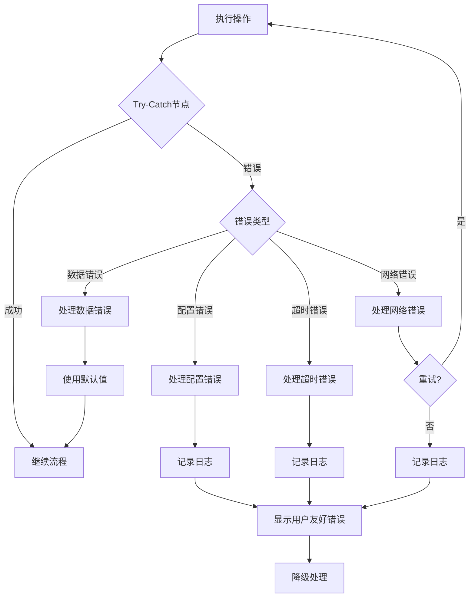

# 挑战系统Workflow低代码实现逻辑

## 1. 整体Workflow架构



## 2. 变量定义和初始化流程



## 3. Workflow读取配置并验证的核心逻辑



## 4. 主循环Workflow实现



## 5. 条件判断节点详细实现



## 6. 运行时目标达成检测（低代码实现）

```mermaid
graph TD
    AIReply[AI回复内容] --> CheckGoalVar{IF节点: targetKeyword!=null}
    
    %% 说出话语检测分支
    CheckGoalVar -->|true| KeywordDetect{IF节点: AI回复.contains(targetKeyword)}
    CheckGoalVar -->|false| CheckActionVar{IF节点: targetAction!=null}
    
    KeywordDetect -->|true| SetSuccess1[设置变量: isSuccess=true]
    KeywordDetect -->|false| CheckActionVar
    
    %% 做出行为检测分支
    CheckActionVar -->|true| ActionDetect{正则匹配节点: 匹配targetAction}
    CheckActionVar -->|false| CheckValueVar{IF节点: targetValue!=null}
    
    ActionDetect -->|匹配| SetSuccess2[设置变量: isSuccess=true]
    ActionDetect -->|不匹配| CheckValueVar
    
    %% 改变立场检测分支
    CheckValueVar -->|true| GetCurrentVal[获取变量: currentValue]
    CheckValueVar -->|false| CheckOptionsVar{IF节点: judgeOptions!=null}
    
    GetCurrentVal --> CompareVal{IF节点: currentValue >= targetValue}
    CompareVal -->|true| SetSuccess3[设置变量: isSuccess=true]
    CompareVal -->|false| CheckOptionsVar
    
    %% 做出判断检测分支
    CheckOptionsVar -->|true| GetUserChoice[获取: 用户选择]
    CheckOptionsVar -->|false| NoCheck[无需检测]
    
    GetUserChoice --> ValidateChoice{IF节点: 选择 in judgeOptions}
    ValidateChoice -->|true| SetSuccess4[设置变量: isSuccess=true]
    ValidateChoice -->|false| NoCheck
    
    %% 汇总检测结果
    SetSuccess1 & SetSuccess2 & SetSuccess3 & SetSuccess4 --> TriggerSuccess[触发成功流程]
    NoCheck --> ContinueGame[继续游戏循环]
    
    style CheckGoalVar fill:#fff3e0
    style CheckActionVar fill:#fff3e0
    style CheckValueVar fill:#fff3e0
    style CheckOptionsVar fill:#fff3e0
    style KeywordDetect fill:#e8f5e9
    style ActionDetect fill:#e8f5e9
    style CompareVal fill:#e8f5e9
    style ValidateChoice fill:#e8f5e9
```

## 7. 实际低代码节点配置示例



## 6. 目标检测Workflow



## 7. 低代码节点类型映射



## 8. 实际Workflow示例：时间限制挑战

```mermaid
graph TD
    Start([开始]) --> SetVar1[设置变量: timeLimit=180]
    SetVar1 --> SetVar2[设置变量: startTime=now()]
    SetVar2 --> SetVar3[设置变量: targetPhrase='我爱你']
    SetVar3 --> ShowOpening[显示: 开场白]
    
    ShowOpening --> LoopStart{循环开始}
    LoopStart --> CalcTime[计算: remainTime = timeLimit - (now - startTime)]
    CalcTime --> CheckTime{remainTime > 0?}
    
    CheckTime -->|否| ShowFail[显示: 挑战失败]
    CheckTime -->|是| ShowTime[显示: 剩余时间]
    
    ShowTime --> WaitUser[等待: 用户输入]
    WaitUser --> SaveInput[保存: userInput]
    
    SaveInput --> CallAI[调用: AI回复API]
    CallAI --> SaveAIReply[保存: aiReply]
    
    SaveAIReply --> CheckPhrase{aiReply包含targetPhrase?}
    CheckPhrase -->|是| ShowSuccess[显示: 挑战成功]
    CheckPhrase -->|否| ShowAIReply[显示: AI回复]
    
    ShowAIReply --> LoopStart
    
    ShowSuccess --> ShowReward[显示: 奖励内容]
    ShowFail --> ShowRetry[显示: 重试按钮]
    
    ShowReward --> End([结束])
    ShowRetry --> End
    
    %% 样式
    style Start fill:#90EE90
    style End fill:#FFB6C1
    style CheckTime fill:#FFE4B5
    style CheckPhrase fill:#FFE4B5
    style ShowSuccess fill:#98FB98
    style ShowFail fill:#FFA07A
```

## 9. 变量和数据流



## 10. 错误处理Workflow



---

## 总结：低代码实现要点

### 核心节点类型需求：
1. **变量管理节点** - 设置/获取变量值
2. **条件判断节点** - IF-ELSE分支逻辑
3. **循环控制节点** - WHILE/FOR循环
4. **API调用节点** - 调用AI接口
5. **定时器节点** - 倒计时功能
6. **事件监听节点** - 用户输入监听
7. **数据转换节点** - JSON解析、字符串处理
8. **路由分发节点** - 根据类型分发流程

### 关键实现细节：
- 所有字段都通过变量存储
- 空值检测使用IF节点判断 `variable == null || variable == ""`
- 字符串匹配可用包含检测或正则表达式
- 数值比较直接使用比较运算符
- 循环使用计数器或条件控制
- 错误处理使用Try-Catch包装

这种低代码实现方式让非技术人员也能配置和修改挑战流程！