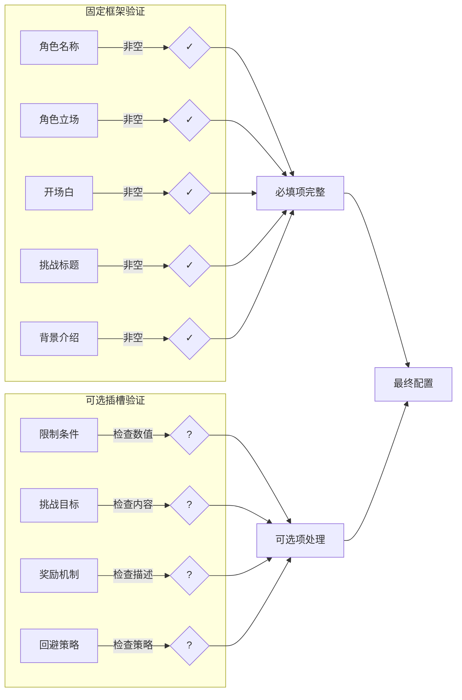
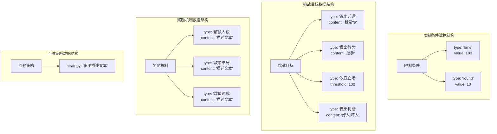
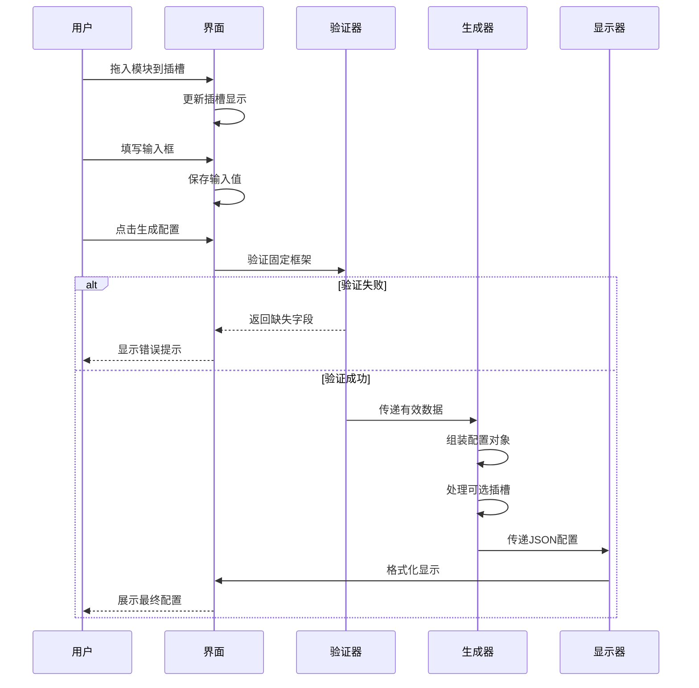
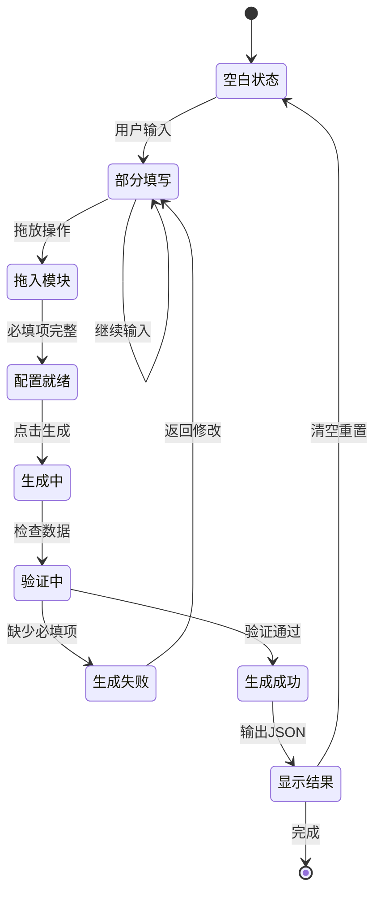
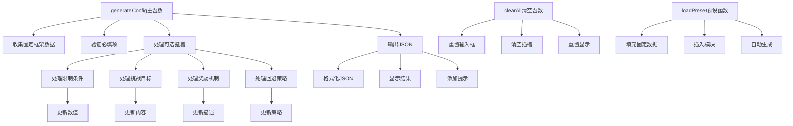
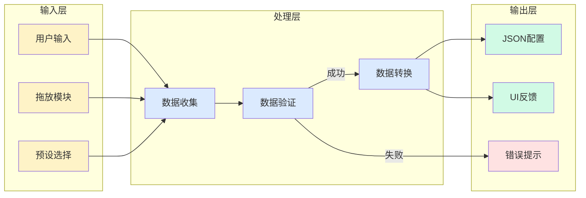

# 挑战系统配置生成流程图

## 核心流程逻辑

```mermaid
graph TB
    Start([用户点击生成配置]) --> CheckFixed{检查固定框架}
    
    %% 固定框架验证分支
    CheckFixed -->|缺失必填项| ShowError[显示缺失字段提示]
    ShowError --> End1([结束])
    
    CheckFixed -->|全部填写| InitConfig[初始化配置对象]
    
    %% 配置初始化
    InitConfig --> AddFixed[添加固定框架数据]
    AddFixed --> |角色名称<br/>角色立场<br/>开场白<br/>挑战标题<br/>背景介绍| CheckSlots{检查可选插槽}
    
    %% 插槽处理主流程
    CheckSlots --> ProcessLimit{处理限制条件插槽}
    ProcessLimit -->|有模块| CheckLimitType{检查限制类型}
    ProcessLimit -->|空| ProcessGoal{处理挑战目标插槽}
    
    %% 限制条件分支
    CheckLimitType -->|时间限制| AddTimeLimit[添加时间数值]
    CheckLimitType -->|轮次限制| AddRoundLimit[添加轮次数值]
    AddTimeLimit --> ProcessGoal
    AddRoundLimit --> ProcessGoal
    
    %% 挑战目标分支
    ProcessGoal -->|有模块| CheckGoalType{检查目标类型}
    ProcessGoal -->|空| ProcessReward{处理奖励机制插槽}
    
    CheckGoalType -->|说出话语| AddSpeechGoal[添加话语内容]
    CheckGoalType -->|做出行为| AddActionGoal[添加行为内容]
    CheckGoalType -->|改变立场| AddValueGoal[添加数值目标]
    CheckGoalType -->|做出判断| AddJudgeGoal[添加判断选项]
    
    AddSpeechGoal --> ProcessReward
    AddActionGoal --> ProcessReward
    AddValueGoal --> ProcessReward
    AddJudgeGoal --> ProcessReward
    
    %% 奖励机制分支
    ProcessReward -->|有模块| CheckRewardType{检查奖励类型}
    ProcessReward -->|空| ProcessDifficulty{处理回避策略插槽}
    
    CheckRewardType -->|解锁人设| AddCharReward[添加人设描述]
    CheckRewardType -->|故事结局| AddStoryReward[添加结局描述]
    CheckRewardType -->|数值达成| AddScoreReward[添加成就描述]
    
    AddCharReward --> ProcessDifficulty
    AddStoryReward --> ProcessDifficulty
    AddScoreReward --> ProcessDifficulty
    
    %% 回避策略分支
    ProcessDifficulty -->|有模块| AddStrategy[添加策略描述]
    ProcessDifficulty -->|空| GenerateJSON[生成JSON配置]
    AddStrategy --> GenerateJSON
    
    %% 输出结果
    GenerateJSON --> DisplayConfig[显示配置结果]
    DisplayConfig --> CheckEmpty{是否有可选插槽}
    CheckEmpty -->|无| AddHint[添加提示信息]
    CheckEmpty -->|有| End2([完成])
    AddHint --> End2

    %% 样式定义
    classDef required fill:#fef3c7,stroke:#f59e0b,stroke-width:2px
    classDef optional fill:#dbeafe,stroke:#3b82f6,stroke-width:2px
    classDef process fill:#e9d5ff,stroke:#9333ea,stroke-width:2px
    classDef decision fill:#fce7f3,stroke:#ec4899,stroke-width:2px
    classDef output fill:#d1fae5,stroke:#10b981,stroke-width:2px
    
    class CheckFixed,InitConfig,AddFixed required
    class ProcessLimit,ProcessGoal,ProcessReward,ProcessDifficulty optional
    class CheckLimitType,CheckGoalType,CheckRewardType,CheckEmpty decision
    class GenerateJSON,DisplayConfig output
```

## 数据验证逻辑

## 插槽数据结构

## 用户交互流程

## 配置生成状态机

## 核心函数调用关系

## 数据流向图

---

这些流程图完整展示了配置生成功能的：
1. **主流程** - 从用户操作到最终输出的完整路径
2. **验证逻辑** - 必填项和可选项的验证机制
3. **数据结构** - 各个插槽的数据组织方式
4. **交互时序** - 用户与系统的交互顺序
5. **状态转换** - 系统在不同状态间的转换
6. **函数关系** - 核心函数的调用层次
7. **数据流向** - 数据在系统中的流动路径